# Diagrams: Capstone Physical AI Project

## Overview

This module provides architectural diagrams and visual representations for the complete Physical AI system integration. These diagrams illustrate how all components from previous modules work together in a cohesive system.

## 1. System Architecture Diagrams

### 1.1 High-Level System Architecture

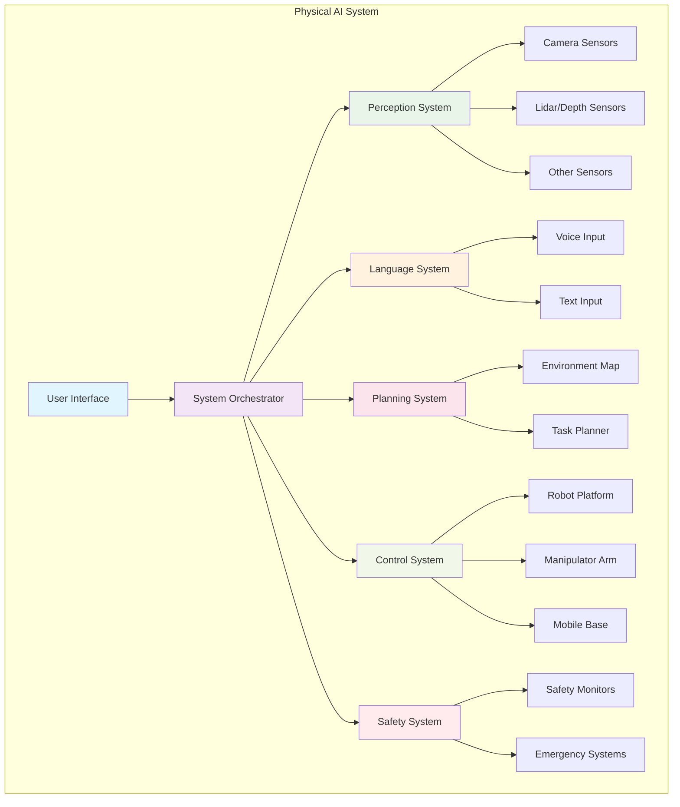

### 1.2 Component Interaction Flow

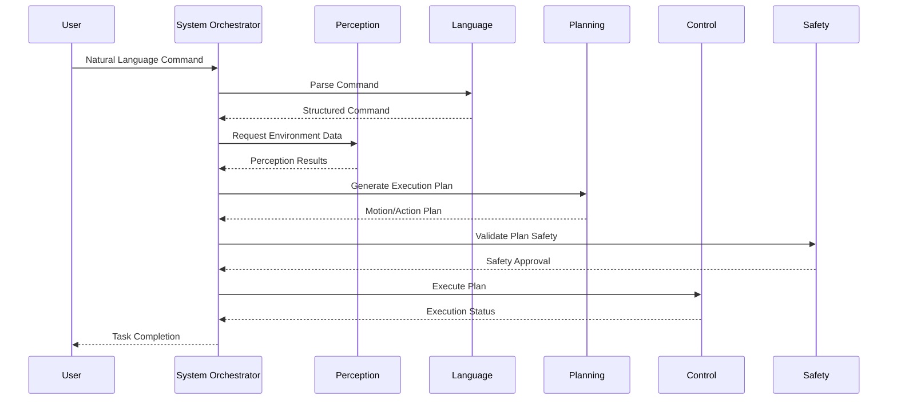

## 2. Integration Architecture

### 2.1 Data Flow Architecture

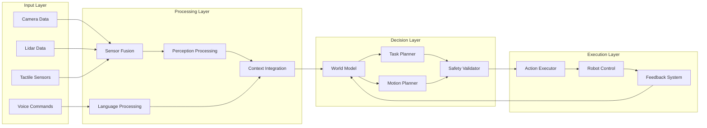

### 2.2 Safety Architecture

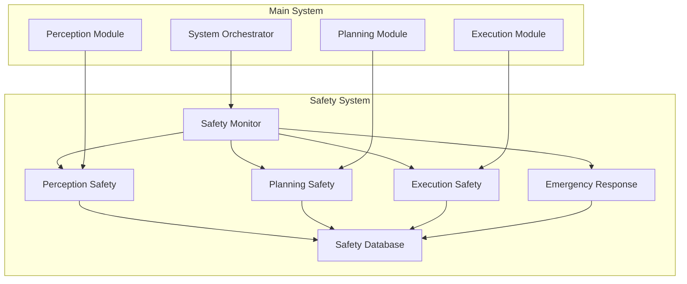

## 3. Physical AI System Components

### 3.1 Vision-Language-Action Pipeline

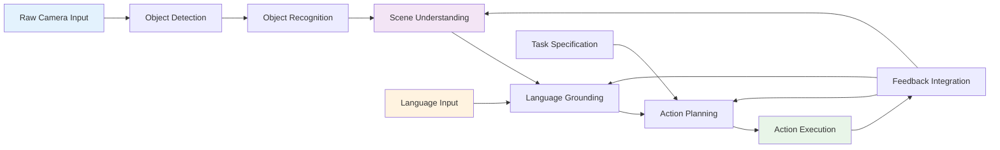

### 3.2 Multi-Robot Coordination Architecture

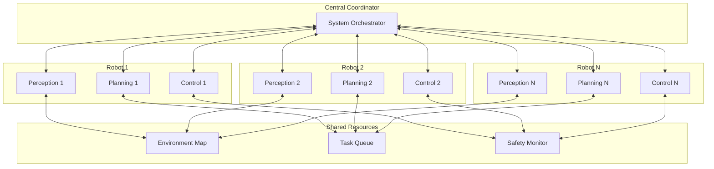

## 4. Human-Robot Interaction Design

### 4.1 Interaction Flow Diagram

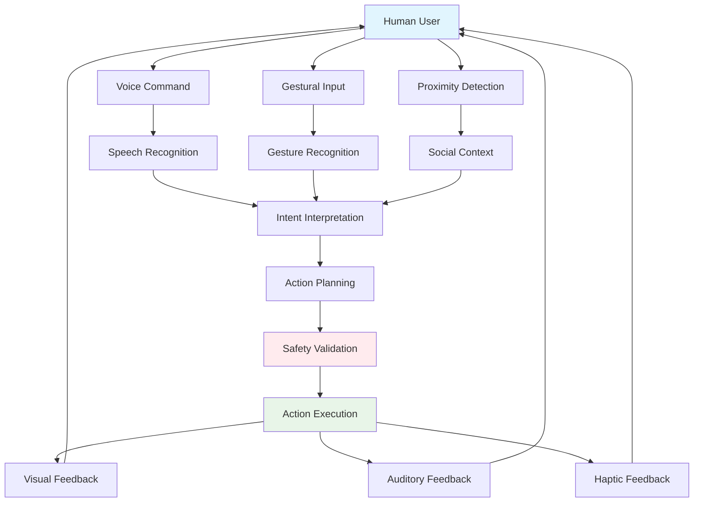

### 4.2 Trust and Safety Visualization

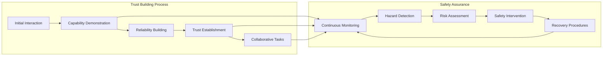

## 5. Performance and Evaluation Metrics

### 5.1 Performance Dashboard Architecture

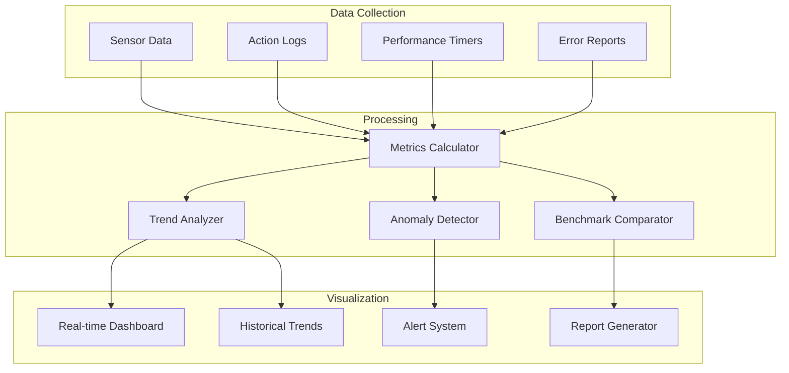

### 5.2 System Evaluation Framework

```mermaid
graph TD
    A[System Evaluation] --> B[Functional Testing]
    A --> C[Safety Assessment]
    A --> D[Performance Benchmarking]
    A --> E[Usability Testing]
    A --> F[Ethics Review]

    B --> B1[Task Completion Rate]
    B --> B2[Accuracy Metrics]
    B --> B3[Robustness Tests]

    C --> C1[Hazard Analysis]
    C --> C2[Safety Protocol Tests]
    C --> C3[Emergency Response]

    D --> D1[Speed Benchmarks]
    D --> D2[Resource Utilization]
    D --> D3[Scalability Tests]

    E --> E1[User Satisfaction]
    E --> E2[Interaction Quality]
    E --> E3[Learning Curve]

    F --> F1[Bias Detection]
    F --> F2[Fairness Assessment]
    F --> F3[Privacy Compliance]

    style A fill:#e0e0e0
    style B fill:#e3f2fd
    style C fill:#ffebee
    style D fill:#f3e5f5
    style E fill:#e8f5e8
    style F fill:#fff3e0
```

## 6. Implementation Architecture

### 6.1 Software Architecture Layers

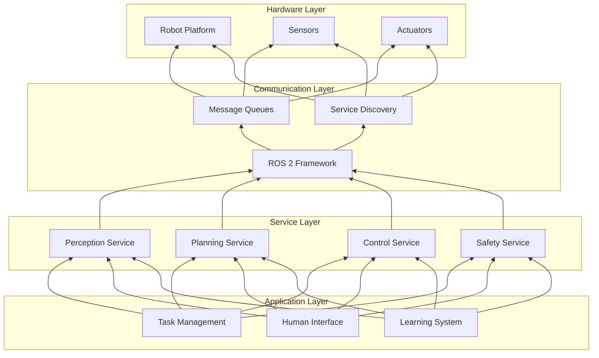

### 6.2 Deployment Architecture

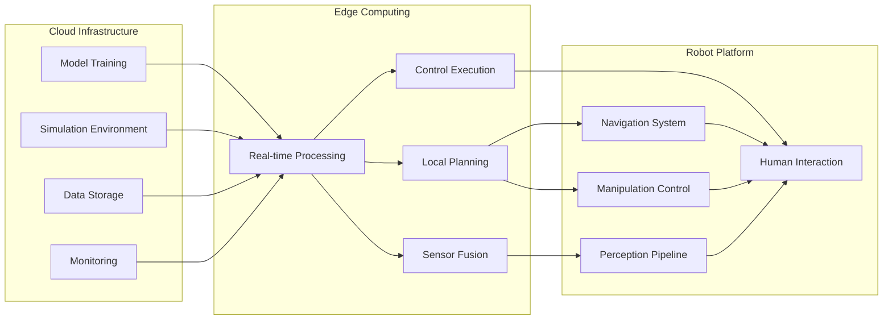

## 7. Safety and Ethics Integration

### 7.1 Ethical Decision Framework

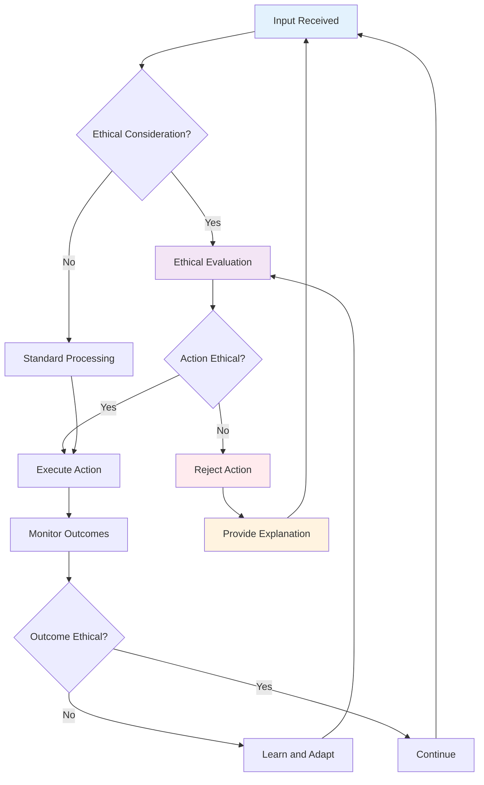

### 7.2 Risk Management Matrix

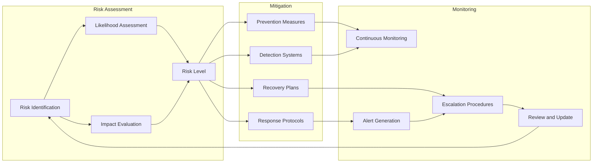

These diagrams provide a comprehensive visual representation of the integrated Physical AI system, showing how all components from the previous modules work together to create a complete, functional, and safe system for the capstone project.