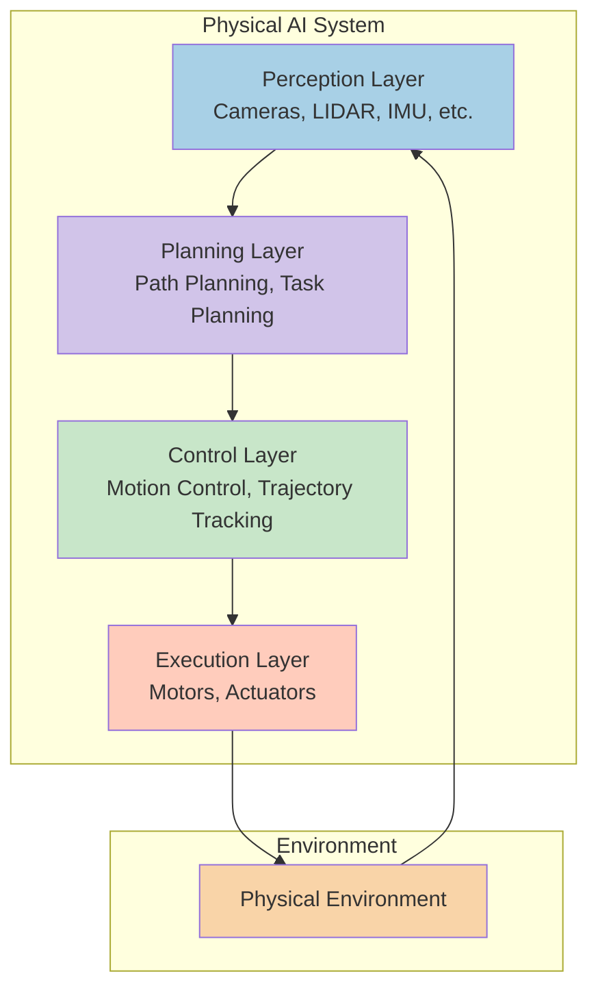
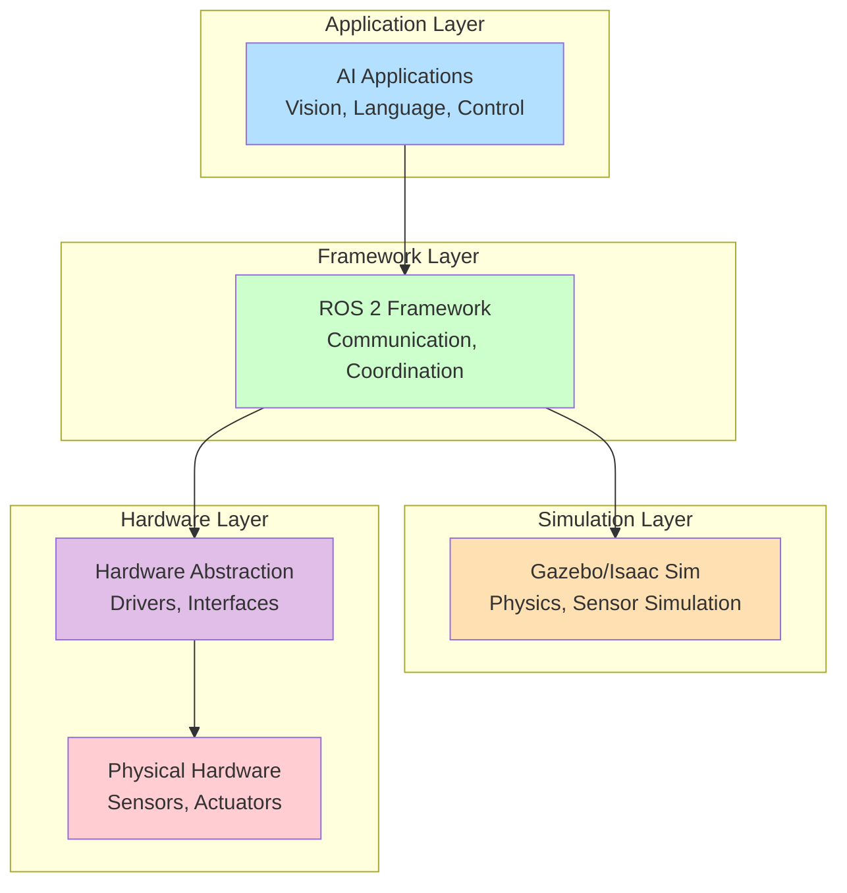
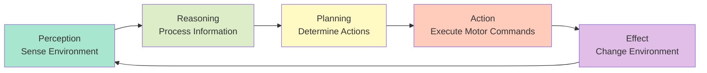
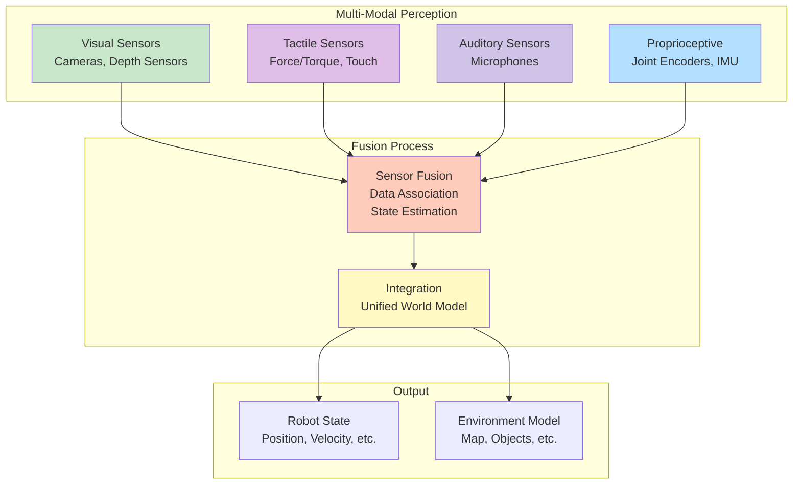
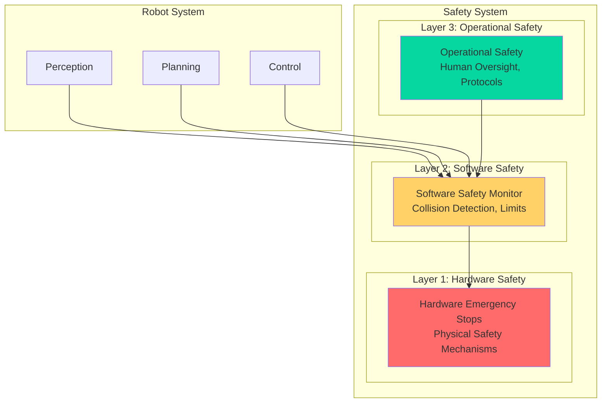
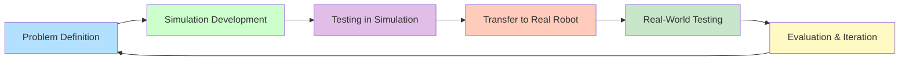
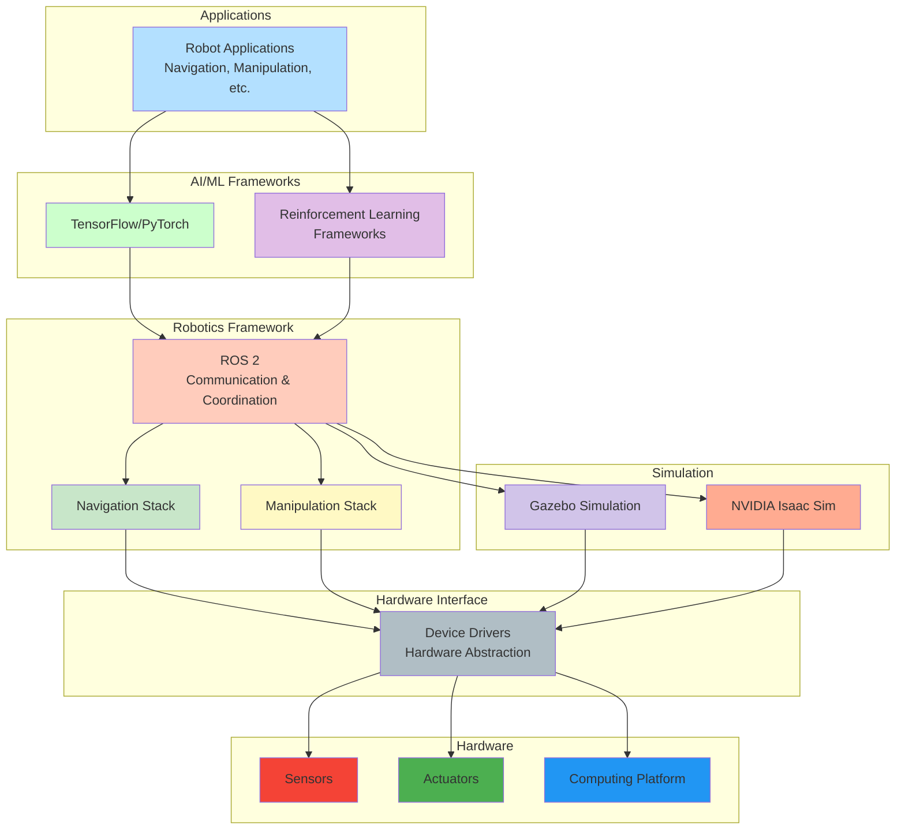
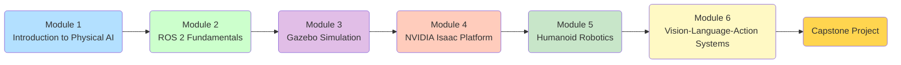

# Diagrams: Introduction to Physical AI

## 1. Physical AI Architecture Overview

### 1.1 High-Level Architecture

### 1.2 Software Stack Architecture

## 2. Action-Perception Loop

### 2.1 Continuous Loop Process

## 3. Sensor Integration Architecture

### 3.1 Multi-Modal Sensor Fusion

## 4. Safety Architecture

### 4.1 Multi-Layer Safety System

## 5. Development Workflow

### 5.1 Physical AI Development Cycle

## 6. Technology Ecosystem

### 6.1 Physical AI Technology Stack

## 7. Learning Progression Path

### 7.1 Course Module Flow

These diagrams provide visual representations of key concepts in Physical AI, helping to understand the architecture, processes, and relationships between different components of Physical AI systems.