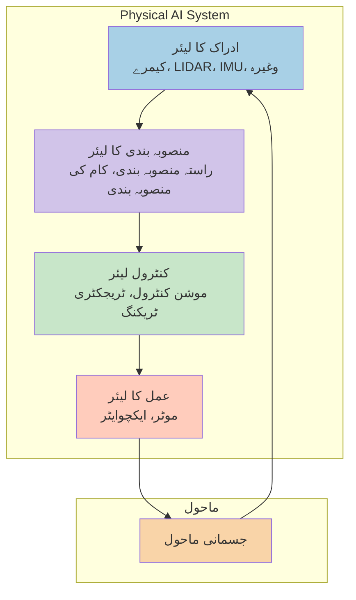

# ماڈیول 1: جسمانی مصنوعی ذہانت کا تعارف - اردو ترجمہ

## جدول کا خلاصہ
- [1. جسمانی مصنوعی ذہانت کا تعارف](#1-جسمانی-مصنوعی-ذہانت-کا-تعارف)
- [2. جسمانی مصنوعی ذہانت کی تعلیمی اہداف](#2-جسمانی-مصنوعی-ذہانت-کی-تعلیمی-اهداف)
- [3. نظریاتی بنیادیں](#3-نظریاتی-بنیادیں)
- [4. کوڈ کی مثالیں](#4-کوڈ-کی-مثالیں)
- [5. معلوماتی ڈائیاگرام](#5-معلوماتی-ڈائیاگرام)
- [6. عملی ورکشاپس](#6-عملی-ورکشاپس)
- [7. آزمائشی سوالات](#7-آزمائشی-سوالات)
- [8. ذاتی نوعیت](#8-ذاتی-نوعیت)

## 1. جسمانی مصنوعی ذہانت کا تعارف

### جائزہ

جسمانی مصنوعی ذہانت اور انسان نما روبوٹکس کی جامع کتاب کا خیرمقدم ہے۔ یہ ماڈیول آپ کو جسمانی مصنوعی ذہانت کے بنیادی تصورات سے متعارف کراتا ہے، جو مصنوعی ذہانت کو جسمانی نظاموں کے ساتھ جوڑتا ہے تاکہ وہ حقیقی دنیا کے ساتھ تعامل کر سکیں۔

### جسمانی مصنوعی ذہانت کیا ہے؟

جسمانی مصنوعی ذہانت ایک مین فیلڈ ہے جو مصنوعی ذہانت، روبوٹکس، کنٹرول تھیوری، اور فزکس کو جوڑتا ہے تاکہ ایسے نظام تیار کیے جا سکیں جو حقیقی دنیا میں ادراک، منطق، اور عمل کر سکیں۔ روایتی مصنوعی ذہانت کے نظاموں کے برعکس جو مجازی ماحول میں کام کرتے ہیں (جیسے زبان کے ماڈل یا تجویز کار نظام)، جسمانی مصنوعی ذہانت کے نظاموں کو حقیقی دنیا کی فزکس، سینسر کی شور، ایکچوایٹر کی پابندیوں، اور متحرک ماحول کی پیچیدگیوں کو حل کرنا ہوتا ہے۔

جسمانی مصنوعی ذہانت کا بنیادی اصول **مادی شعور** ہے - یہ خیال کہ شعور ایجنٹ اور اس کے جسمانی ماحول کے تعامل سے پیدا ہوتا ہے۔ یہ کلاسیکی مصنوعی ذہانت کے نقطہ نظر کے برعکس ہے جو شعور کو املا کے مطابق ہیرا پھیری کے طور پر سمجھتے ہیں۔

### جسمانی مصنوعی ذہانت کی کلیدی خصوصیات:

- **مادی شعور**: شعور کا تعلق نظام اور اس کے جسمانی ماحول کے تعامل سے ہے
- **ریل ٹائم پروسیسنگ**: نظام کو سخت وقت کی پابندیوں کے اندر ماحولیاتی تبدیلیوں کا جواب دینا ہوتا ہے
- **کثیر حسی ادراک**: بصری، صوتی، چھونے، اور دیگر حسی ان پٹ کو جمع کرنا
- **عمل-ادراک کے چکر**: ادراک، منصوبہ بندی، اور عمل کے مسلسل چکر
- **حفاظت سے متعلق کارروائیاں**: نظام کو انسانوں کے ماحول میں محفوظ طریقے سے کام کرنا ہوتا ہے

### تعلیمی اہداف

اس ماڈیول کے اختتام تک، آپ درج ذیل کر سکیں گے:

1. جسمانی مصنوعی ذہانت کی وضاحت کریں اور روایتی مصنوعی ذہانت کے نقطہ نظر سے اس کا موازنہ کریں
2. جسمانی مصنوعی ذہانت کے نظام تیار کرنے میں اہم چیلنجز کی وضاحت کریں
3. جسمانی مصنوعی ذہانت کے اطلاقیات کو فعال کرنے والی اہم ٹیکنالوجیوں کی شناخت کریں
4. جسمانی مصنوعی ذہانت کی تنصیب میں حفاظت اور اخلاقیات کے جاتے کی وضاحت کریں
5. جسمانی مصنوعی ذہانت اور انسان نما روبوٹکس کے تعلق کی وضاحت کریں

## 2. جسمانی مصنوعی ذہانت کی تعلیمی اہداف

### 1. جسمانی مصنوعی ذہانت کے تصورات کی وضاحت اور سمجھ
- [ ] روایتی مصنوعی ذہانت اور جسمانی مصنوعی ذہانت کے بنیادی فرق کی وضاحت کریں
- [ ] جسمانی مصنوعی ذہانت کے نظاموں کی کلیدی خصوصیات کی شناخت کریں
- [ ] مادی شعور کے نقطہ نظر اور کلاسیکی مصنوعی ذہانت کے نقطہ نظر کے درمیان فرق کریں
- [ ] جسمانی مصنوعی ذہانت کے نظام تیار کرنے میں اہم چیلنجز کی وضاحت کریں

### 2. ٹیکنالوجی اسٹیک کی سمجھ
- [ ] ROS 2 کا کردار جسمانی مصنوعی ذہانت کی ترقی میں سمجھیں
- [ ] Gazebo کی اہمیت کی وضاحت کریں
- [ ] NVIDIA Isaac پلیٹ فارم کی وضاحت کریں
- [ ] جسمانی مصنوعی ذہانت کے نظام کے لیے ضروری ہارڈ ویئر کی شناخت کریں

### 3. حفاظت اور اخلاقیات کے جاتے کی شناخت
- [ ] جسمانی مصنوعی ذہانت کے لیے محفوظ ماحول میں حفاظت کی ضروریات کا تجزیہ کریں
- [ ] جسمانی مصنوعی ذہانت کے نظام کے لیے خطرہ کے جائزے کی میتھوڈالوجی کو لاگو کریں
- [ ] خودکار جسمانی نظاموں میں اخلاقیات کے اثرات کا جائزہ لیں
- [ ] جسمانی مصنوعی ذہانت کی ترقی کے لیے محفوظ-پہل کے نقطہ نظر کو ڈیزائن کریں

### 4. ترقی کا ماحول قائم کریں
- [ ] ROS 2 Humble Hawksbill ماحول قائم کریں
- [ ] Gazebo Garden سimulator انسٹال اور تشکیل دیں
- [ ] NVIDIA Isaac Sim کو مناسب ہارڈ ویئر کے ساتھ تشکیل دیں
- [ ] بنیادی ٹیسٹ کے ساتھ ترقی کا ماحول کی توثیق کریں

## 3. نظریاتی بنیادیں

### 3.1 جسمانی مصنوعی ذہانت کی بنیادیں

#### 3.1.1 تعریف اور بنیادی تصورات

جسمانی مصنوعی ذہانت ایک مین فیلڈ ہے جو مصنوعی ذہانت کو روبوٹکس، کنٹرول تھیوری، اور فزکس کے ساتھ جوڑتا ہے تاکہ ایسے نظام تیار کیے جا سکیں جو جسمانی دنیا میں ادراک، منطق، اور عمل کر سکیں۔ روایتی مصنوعی ذہانت کے نظاموں کے برعکس جو مجازی ماحول میں کام کرتے ہیں (جیسے زبان کے ماڈل یا تجویز کار نظام)، جسمانی مصنوعی ذہانت کے نظاموں کو حقیقی دنیا کی فزکس، سینسر کی شور، ایکچوایٹر کی پابندیوں، اور متحرک ماحول کی پیچیدگیوں کو حل کرنا ہوتا ہے۔

جسمانی مصنوعی ذہانت کا بنیادی اصول **مادی شعور** ہے - یہ خیال کہ شعور ایجنٹ اور اس کے جسمانی ماحول کے تعامل سے پیدا ہوتا ہے۔ یہ کلاسیکی مصنوعی ذہانت کے نقطہ نظر کے برعکس ہے جو شعور کو املا کے مطابق ہیرا پھیری کے طور پر سمجھتے ہیں۔

#### 3.1.2 جسمانی مصنوعی ذہانت کی کلیدی خصوصیات

**مادی شعور**:
جسمانی مصنوعی ذہانت کے نظام اپنی جسمانی شکل اور ماحول کے تعامل سے اپنا شعور حاصل کرتے ہیں:
- جسم کی ساخت سوچنے کے عمل کو متاثر کرتی ہے
- حسی-موٹر کی ا coordination بنیادی ہے
- ماحول بیرونی میموری کا نظام کا کام کرتا ہے
- جسمانی پابندیاں مسئلہ حل کرنے کے نقطہ نظر کو شکل دیتی ہیں

**ریل ٹائم پروسیسنگ**:
جسمانی مصنوعی ذہانت کے نظام سخت وقت کی پابندیوں کے تحت کام کرتے ہیں:
- سینسر ڈیٹا کو تیزی سے پروسیس کرنا ہوتا ہے (عام طور پر 10-100ms ریسپانس ٹائم)
- کنٹرول کمانڈ کو جاری کرنا لازمی ہے
- نظام کی حالت کو ریل ٹائم پر اپ ڈیٹ کرنا ہوتا ہے
- تاخیر نظام کی ناکامی یا حفاظت کے خطرات کا سبب بن سکتی ہے

**کثیر حسی ادراک**:
جسمانی مصنوعی ذہانت کے نظام کثیر حسی ماڈل کو جمع کرتے ہیں:
- بصری ادراک (کیمرے، LIDAR، ڈیپتھ سینسر)
- چھونے کی فیڈ بیک (فورس/ٹورک سینسر، ٹیکٹائل سکن)
- صوتی ان پٹ (مکرو فون برائے گفتگو اور ماحولیاتی آوازیں)
- پروپریوسیفٹو ادراک (جائنٹ انکوڈر، IMUs، موٹر کرنٹ سینسر)

#### 3.1.3 روایتی مصنوعی ذہانت سے فرق

| روایتی مصنوعی ذہانت | جسمانی مصنوعی ذہانت |
|----------------------|----------------------|
| مجازی/ڈیجیٹل ماحول میں کام کرتا ہے | جسمانی ماحول میں کام کرتا ہے |
| علامتی یا ڈیجیٹل ڈیٹا کو پروسیس کرتا ہے | کثیر ماڈل سینسر ڈیٹا کو پروسیس کرتا ہے |
| آؤٹ پٹ معلومات یا فیصلے ہیں | آؤٹ پٹ جسمانی اعمال ہیں |
| وقت کی پابندیاں لچکدار ہیں | ریل ٹائم پابندیاں اہم ہیں |
| ماحول اکثر قابل پیش گوئی ہوتا ہے | ماحول متحرک اور غیر یقینی ہوتا ہے |

## 4. کوڈ کی مثالیں

### 4.1 بنیادی ROS 2 نوڈ کی ساخت

#### 4.1.1 سادہ پبلشر نوڈ

```python
#!/usr/bin/env python3
"""
جسمانی مصنوعی ذہانت کے نظام کے لیے بنیادی ROS 2 پبلشر نوڈ
"""
import rclpy
from rclpy.node import Node
from std_msgs.msg import String


class PhysicalAIStatusPublisher(Node):
    def __init__(self):
        super().__init__('physical_ai_status_publisher')
        self.publisher_ = self.create_publisher(String, 'ai_status', 10)
        timer_period = 0.5  # seconds
        self.timer = self.create_timer(timer_period, self.timer_callback)
        self.i = 0

    def timer_callback(self):
        msg = String()
        msg.data = f'Physical AI System Operational: {self.i}'
        self.publisher_.publish(msg)
        self.get_logger().info(f'Publishing: "{msg.data}"')
        self.i += 1


def main(args=None):
    rclpy.init(args=args)
    physical_ai_publisher = PhysicalAIStatusPublisher()

    try:
        rclpy.spin(physical_ai_publisher)
    except KeyboardInterrupt:
        pass
    finally:
        physical_ai_publisher.destroy_node()
        rclpy.shutdown()


if __name__ == '__main__':
    main()
```

### 5. معلوماتی ڈائیاگرام

#### 5.1 جسمانی مصنوعی ذہانت کی مجموعی ڈھانچہ



### 6. عملی ورکشاپس

#### 6.1: جسمانی مصنوعی ذہانت کے ترقی کا ماحول قائم کرنا

** مقصد **:
ROS 2، Gazebo، اور بنیادی اوزار کے ساتھ جسمانی مصنوعی ذہانت کا ترقی کا ماحول قائم کریں۔

** ضروریات **:
- Ubuntu 22.04 LTS کے ساتھ کمپیوٹر (یا WSL2 کے ساتھ Windows)
- کم از کم 8GB RAM (16GB تجویز کردہ)
- NVIDIA Isaac Sim کے لیے مطابقت رکھنے والا GPU (اس لیب کے لیے اختیاری)

** تخمینہ وقت **:
1-2 گھنٹے

** اقدامات **:

** قدم 1: سسٹم کی تیاری **:
1. اپنے سسٹم کے پیکجوں کو اپ ڈیٹ کریں:
   ```bash
   sudo apt update && sudo apt upgrade -y
   ```

2. بنیادی ترقی کے اوزار انسٹال کریں:
   ```bash
   sudo apt install python3-pip python3-colcon-common-extensions build-essential
   ```

### 7. آزمائشی سوالات

#### 7.1: جسمانی مصنوعی ذہانت کے بنیادیات

** سوال 1 **:
روایتی مصنوعی ذہانت اور جسمانی مصنوعی ذہانت کے درمیان کیا بنیادی فرق ہے؟

A) جسمانی مصنوعی ذہانت زیادہ ڈیٹا استعمال کرتا ہے
B) جسمانی مصنوعی ذہانت جسمانی ماحول میں کام کرتا ہے اور حقیقی دنیا کی فزکس کے ساتھ تعامل کرنا ہوتا ہے
C) جسمانی مصنوعی ذہانت تیز ہے
D) جسمانی مصنوعی ذہانت مختلف پروگرامنگ زبانوں کا استعمال کرتا ہے

** درست جواب: B **

### 8. ذاتی نوعیت

#### 8.1: تعلیمی راستہ کی حسب ضرورت

یہ سیکشن ذاتی تعلیمی راستے فراہم کرتا ہے آپ کی پس منظر، تجربے کی سطح، اور جسمانی مصنوعی ذہانت میں اہداف کے مطابق۔

** تجربے کی سطح کا جائزہ **:

** شروع کرنے والا راستہ (0-1 سال کا تجربہ) **:
- طلباء جو روبوٹکس اور مصنوعی ذہانت میں نئے ہیں
- دیگر شعبوں سے جسمانی مصنوعی ذہانت میں منتقل ہونے والے پیشہ ورانہ افراد
- روبوٹکس میں دلچسپی رکھنے والے شوقیہ افراد

** اہم علاقوں پر توجہ **:
- بنیادی تصورات اور اصطلاحات
- ماحول کی ترتیب اور بنیادی اوزار
- سادہ شبیہ سازی کے مشقیں
- حفاظت کے بنیادیات

** تخمینہ وقت **: اس ماڈیول کے لیے 8-10 گھنٹے

** تجویز کردہ سرگرمیاں **:
- تمام بنیادی لیب مشقیں مکمل کریں
- ماحول کی ترتیب پر زیادہ وقت صرف کریں
- بنیادی تصورات کو سمجھنے پر توجہ دیں بجائے جدید ایمپلیمنٹیشن کے
- اضافی تعاون کے لیے آن لائن کمیونٹیز میں شامل ہوں

** درمیانی راستہ (1-3 سال کا تجربہ) **:
- سافٹ ویئر ڈیولپرز جن کو روبوٹکس میں دلچسپی ہے
- کچھ روبوٹکس کے تجربے کے ساتھ انجینئرز
- متعلقہ شعبوں میں گریجویٹ طلباء

** اہم علاقوں پر توجہ **:
- گہرائی میں تکنیکی ایمپلیمنٹیشن
- جدید شبیہ سازی کی تکنیکیں
- متعدد نظاموں کی یکجہتی
- کارکردگی کی بہتری

** تخمینہ وقت **: اس ماڈیول کے لیے 6-8 گھنٹے

** تجویز کردہ سرگرمیاں **:
- بنیادی ترتیب کے ٹیوٹوریلز چھوڑ دیں اگر پہلے سے واقف ہیں
- ہاتھوں سے ایمپلیمنٹیشن مشقیں پر توجہ دیں
- اضافی وسائل اور توسیعات کو تلاش کریں
- منصوبہ بندی کے بارے میں سوچنا شروع کریں

** جدید راستہ (3+ سال کا تجربہ) **:
- روبوٹکس کے محققین
- متعلقہ شعبوں میں تجربہ کار انجینئرز
- روبوٹکس/مصنوعی ذہانت میں PhD طلباء

** اہم علاقوں پر توجہ **:
- جدید تحقیقی موضوعات
- نظام کی آرکیٹیکچر اور ڈیزائن
- جدید حفاظت اور اخلاقیات کے جاتے
- تحقیقی منصوبہ بندی

** تخمینہ وقت **: اس ماڈیول کے لیے 4-6 گھنٹے

** تجویز کردہ سرگرمیاں **:
- تحقیقی کاغذات اور جدید تصورات پر توجہ دیں
- بنیادی ٹیوٹوریلز چھوڑ دیں
- مطالعہ گروپوں میں دیگر کو مہذب کریں
- کھلے ماخذ جسمانی مصنوعی ذہانت پروجیکٹس میں شراکت داری کریں

---

** نوٹ **: یہ اردو ترجمہ جسمانی مصنوعی ذہانت کے ماڈیول 1 کا مکمل ترجمہ ہے۔ مکمل کتاب کے دیگر ماڈیولز کے لیے مزید ترجمے تیار کیے جائیں گے۔