# Diagrams: ROS 2 Fundamentals for Physical AI

## 1. ROS 2 Architecture Overview

### 1.1 ROS 2 System Architecture
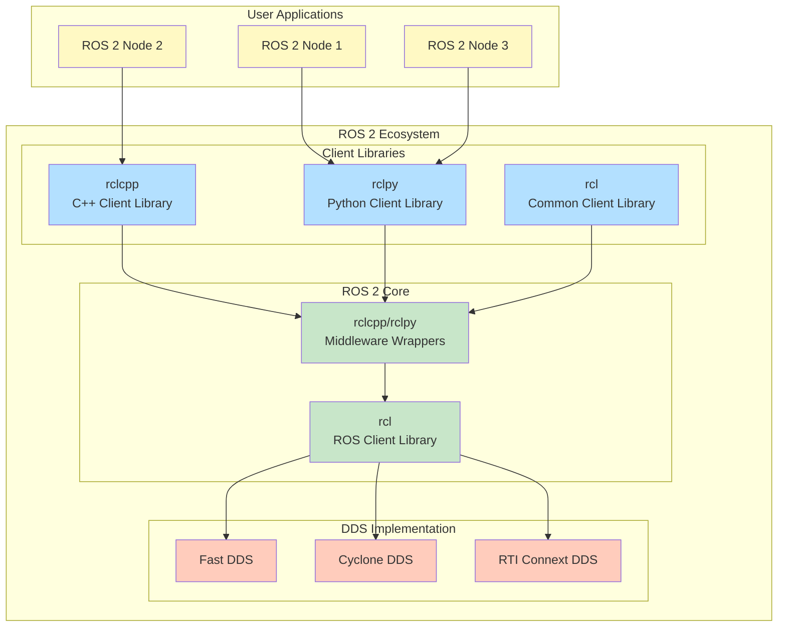

### 1.2 Node Communication Architecture
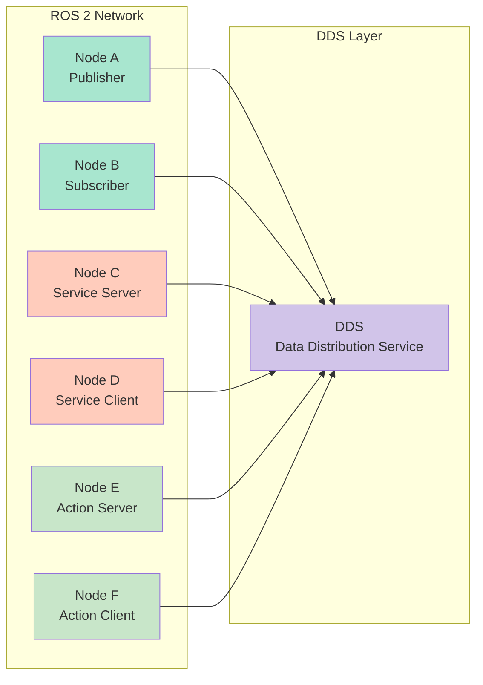

## 2. Communication Patterns

### 2.1 Publisher-Subscriber Pattern
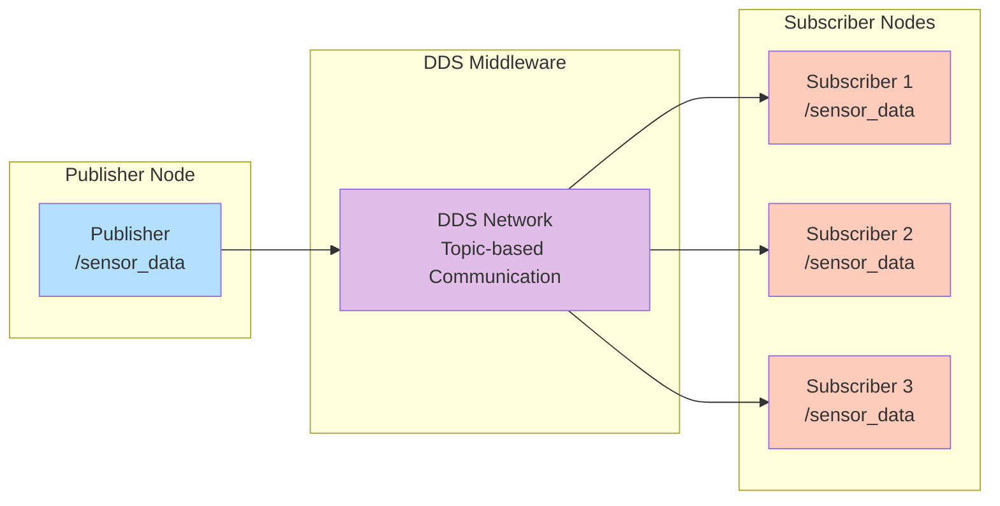

### 2.2 Service Request-Response Pattern
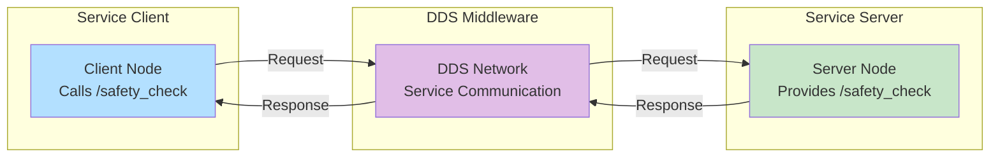

### 2.3 Action Goal-Feedback-Result Pattern
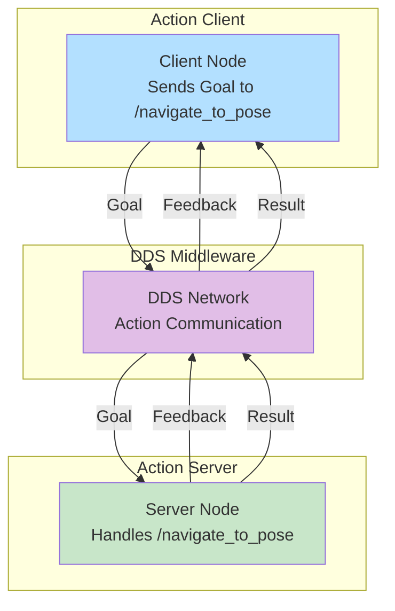

## 3. Quality of Service (QoS) Policies

### 3.1 Reliability Policy Comparison
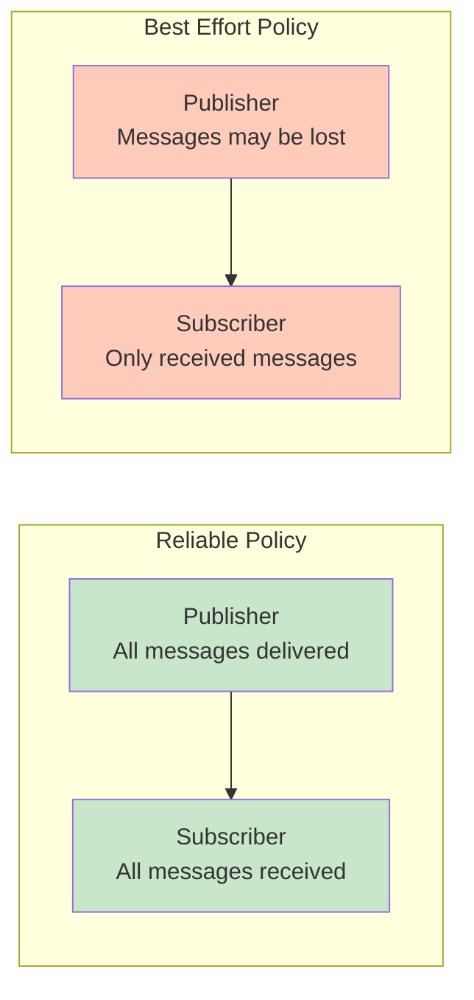

### 3.2 Durability Policy Comparison
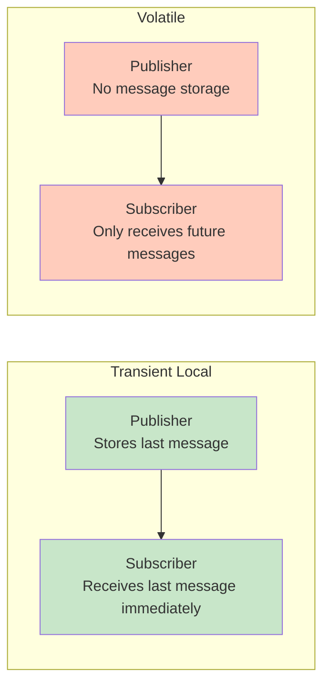

## 4. Package Structure

### 4.1 ROS 2 Package Organization
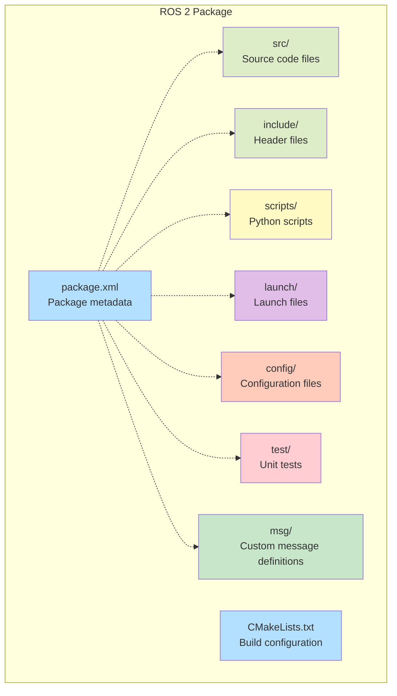

## 5. Launch System Architecture

### 5.1 Launch File Components
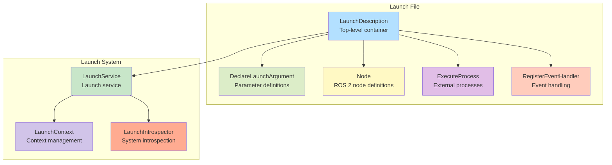

## 6. Physical AI System Architecture

### 6.1 Complete Physical AI System with ROS 2
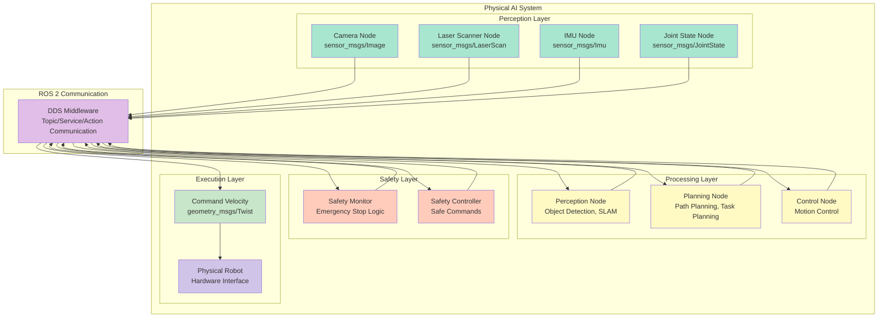

## 7. Parameter Management

### 7.1 Parameter Server Architecture
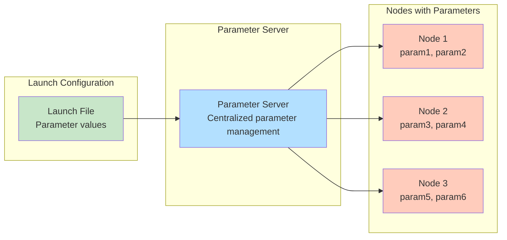

## 8. Tools and Ecosystem

### 8.1 ROS 2 Tool Ecosystem
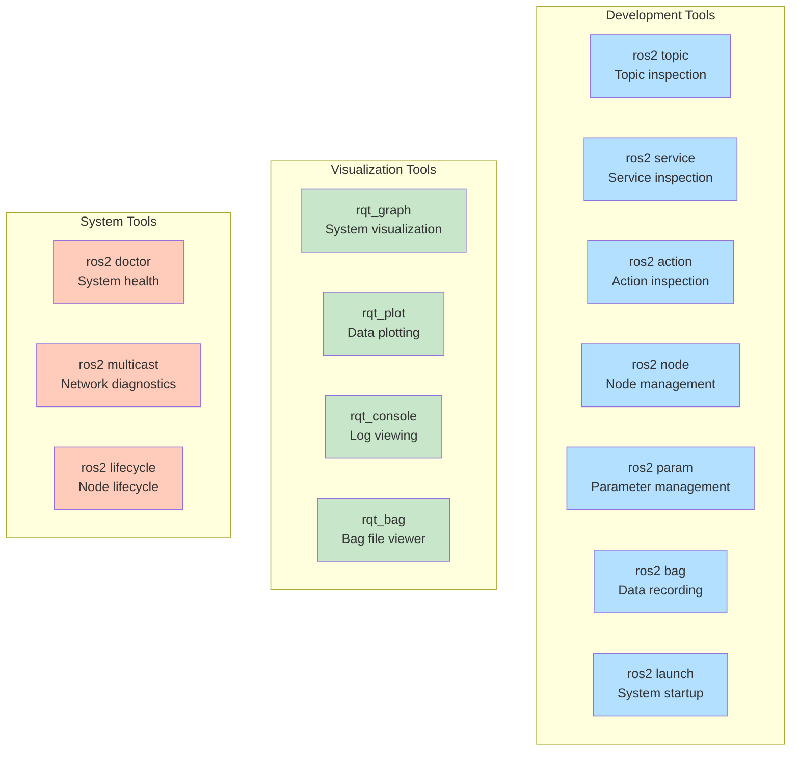

## 9. Safety Architecture

### 9.1 Multi-layer Safety System with ROS 2
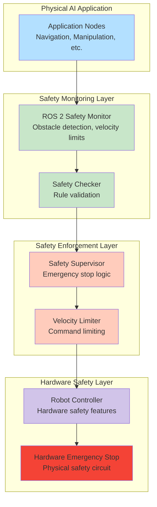

These diagrams provide visual representations of key ROS 2 concepts and architectures relevant to Physical AI systems, helping to understand the communication patterns, system architecture, and safety considerations involved in ROS 2-based Physical AI applications.