# Diagrams: Gazebo Simulation and Physics Engines

## 1. Gazebo Architecture Overview

### 1.1 Gazebo System Architecture
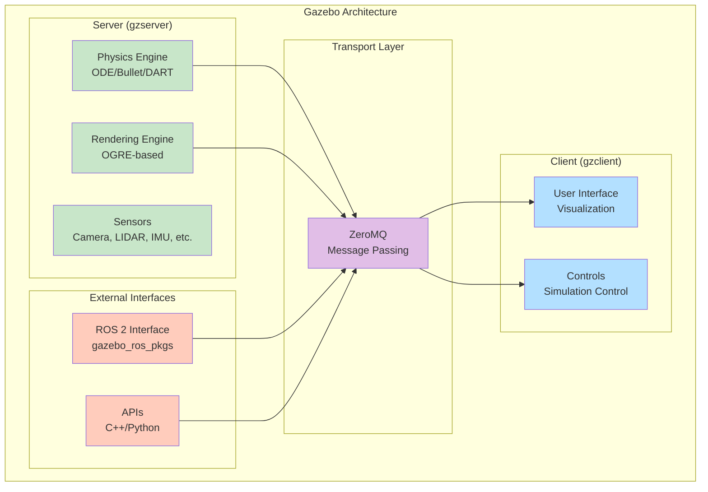

### 1.2 Simulation Loop Architecture
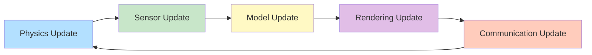

## 2. Robot Modeling Formats

### 2.1 URDF Structure
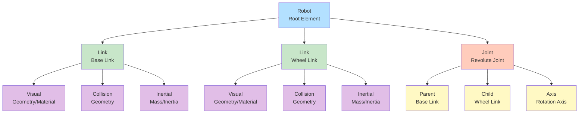

### 2.2 SDF Structure
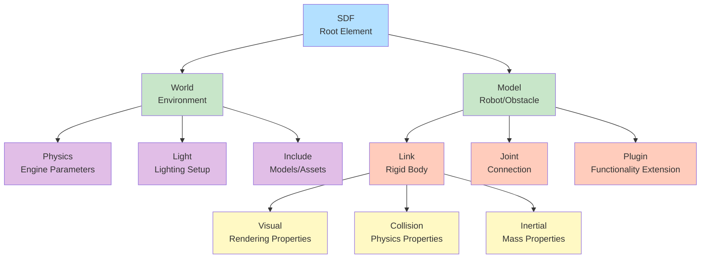

## 3. Physics Simulation Concepts

### 3.1 Physics Engine Hierarchy
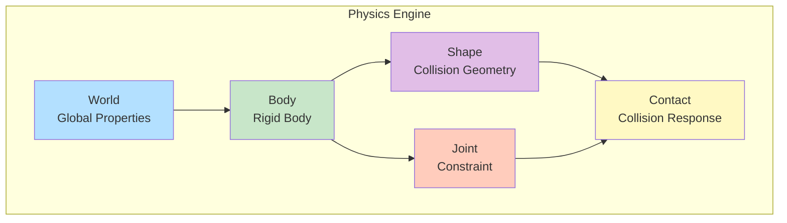

### 3.2 Collision Detection Pipeline
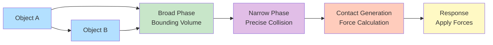

## 4. Sensor Simulation

### 4.1 Sensor Integration Architecture
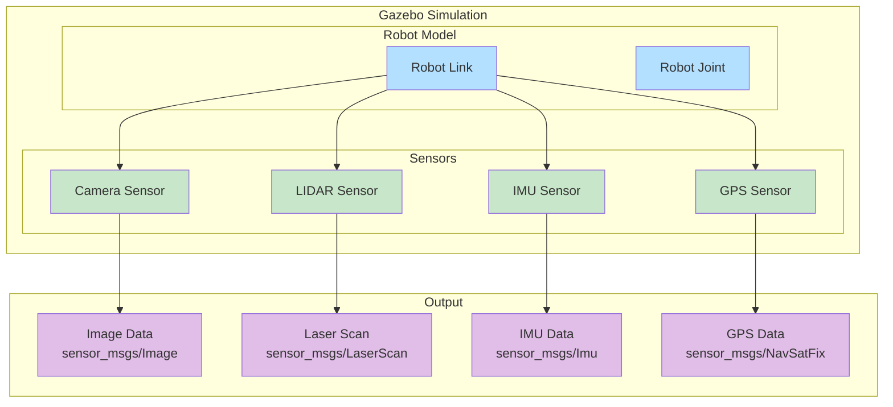

### 4.2 Camera Sensor Pipeline
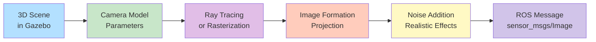

## 5. ROS 2 Integration

### 5.1 Gazebo-ROS Communication
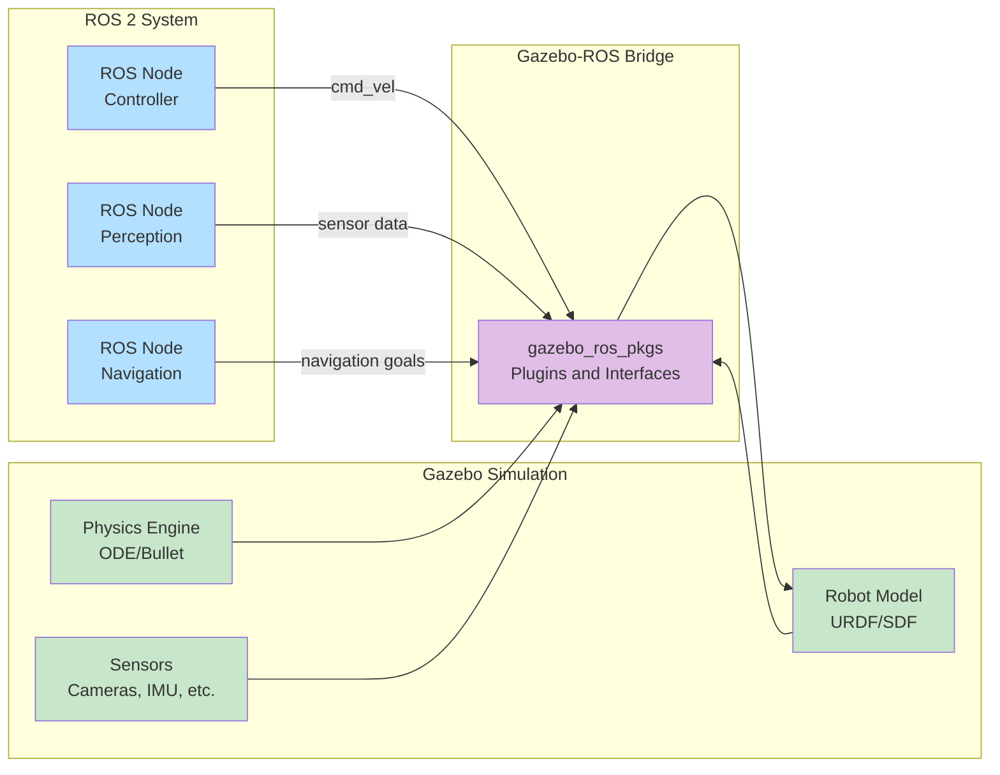

### 5.2 Control Loop Architecture
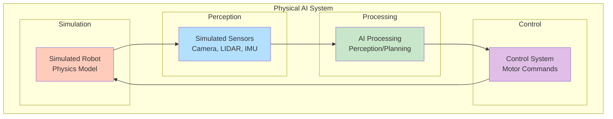

## 6. World and Environment Modeling

### 6.1 World Composition
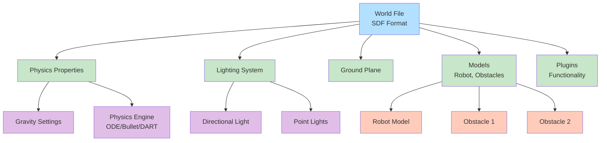

### 6.2 Environment Complexity Levels
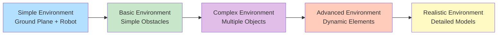

## 7. Simulation Validation

### 7.1 Reality Gap Analysis
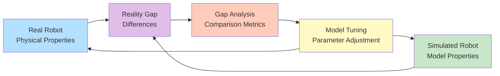

### 7.2 Simulation Fidelity Assessment
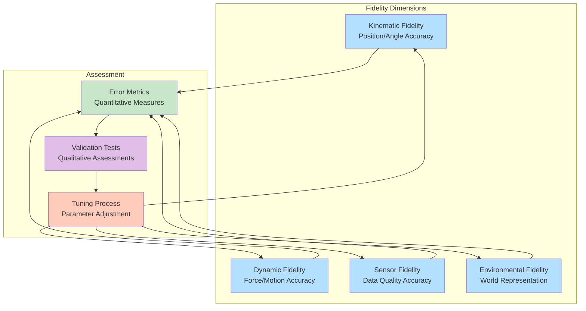

## 8. Advanced Simulation Features

### 8.1 Plugin Architecture
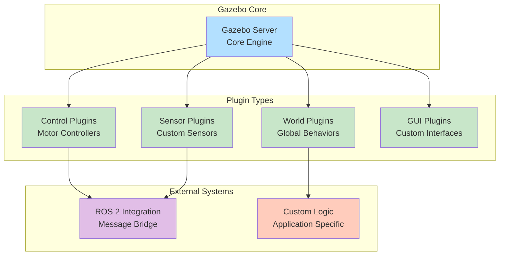

### 8.2 Multi-Robot Simulation
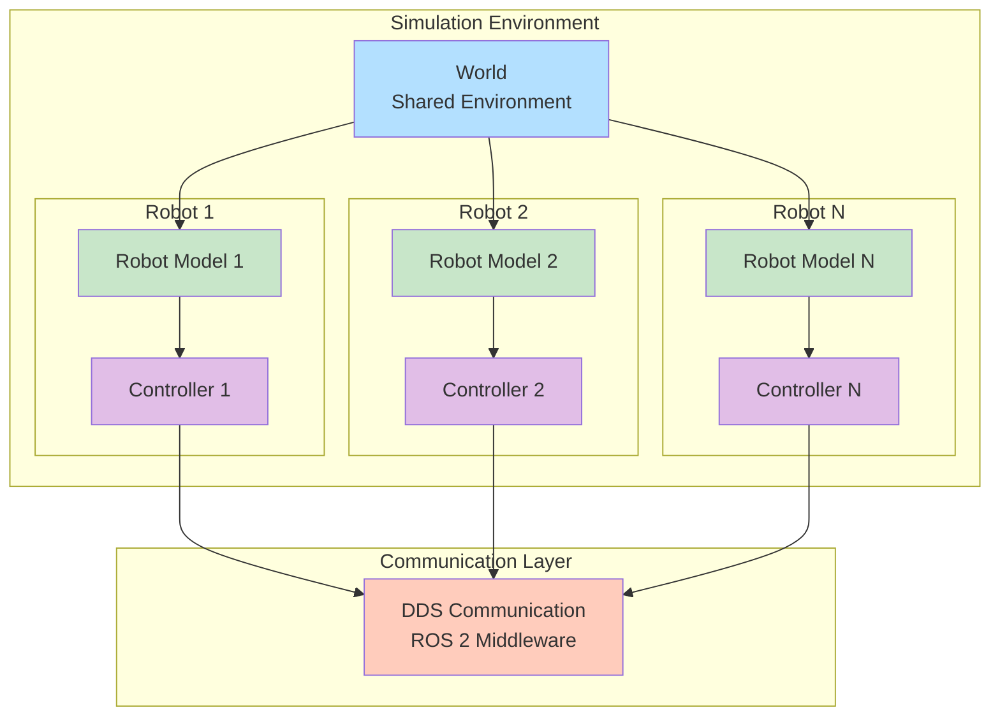

These diagrams provide visual representations of key Gazebo simulation concepts, architecture, and integration patterns relevant to Physical AI systems, helping to understand the complex relationships between simulation components, physics engines, sensors, and ROS 2 integration.