# Diagrams: NVIDIA Isaac Platform and Tools

## 1. Isaac Platform Architecture

### 1.1 Overall Isaac Platform Architecture
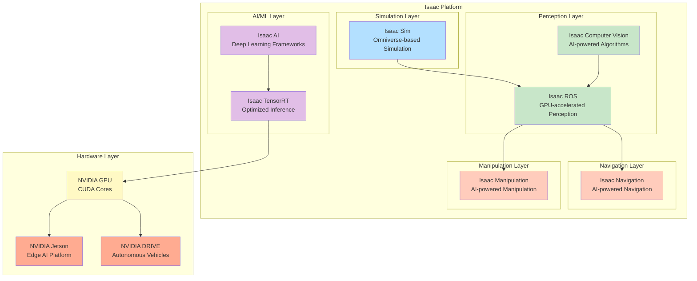

### 1.2 Isaac Sim Architecture
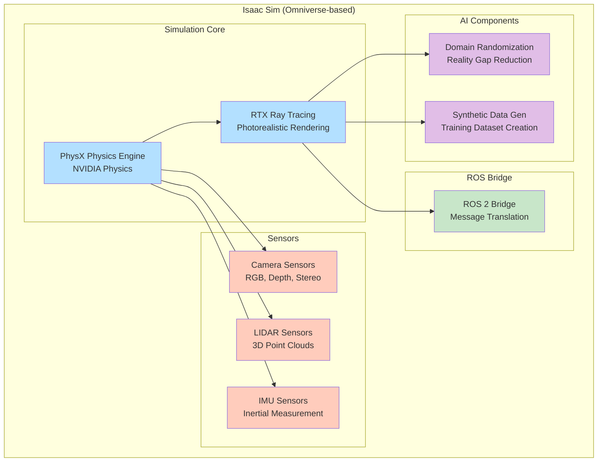

## 2. Isaac ROS Architecture

### 2.1 Isaac ROS Pipeline Architecture
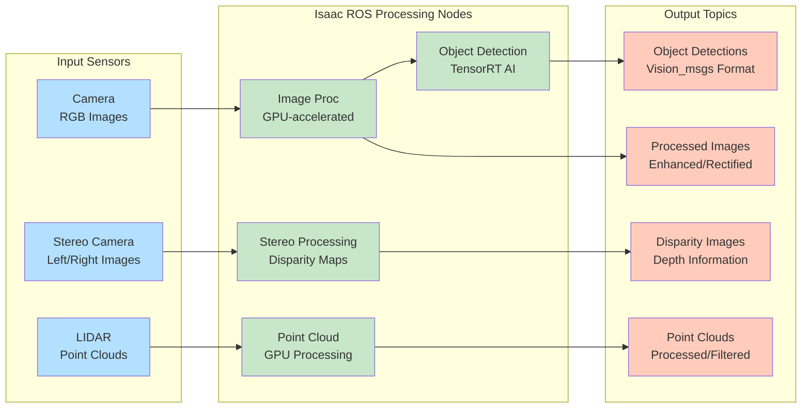

### 2.2 GPU Acceleration in Isaac ROS
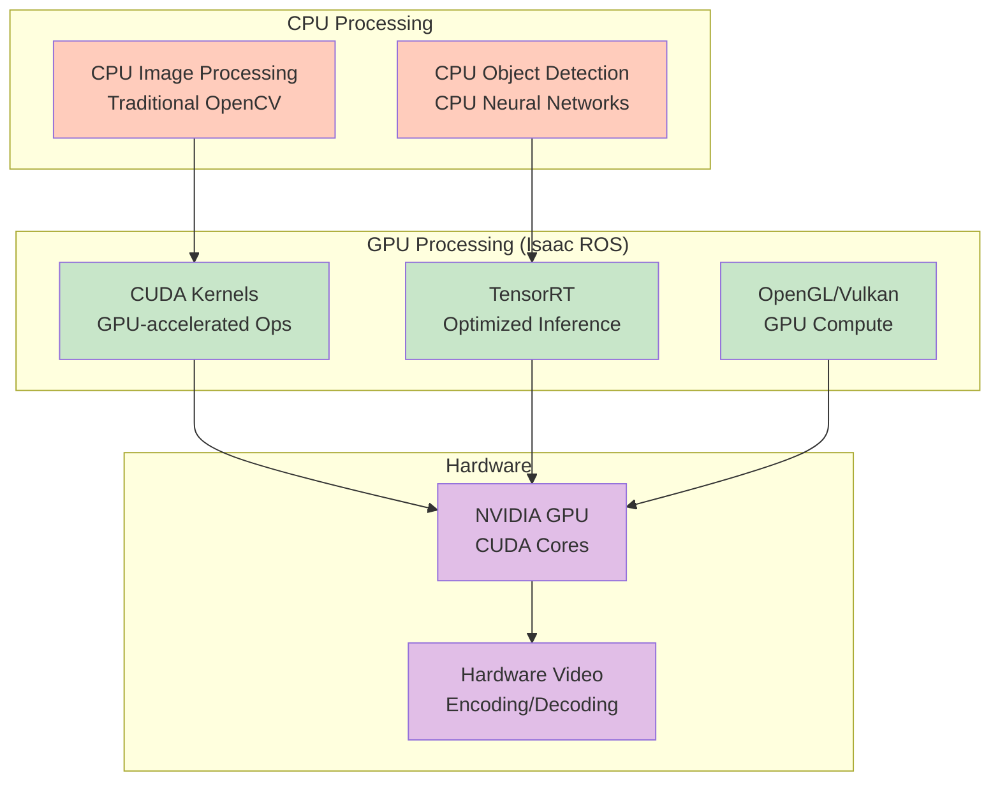

## 3. Isaac Navigation Architecture

### 3.1 Isaac Navigation System Architecture
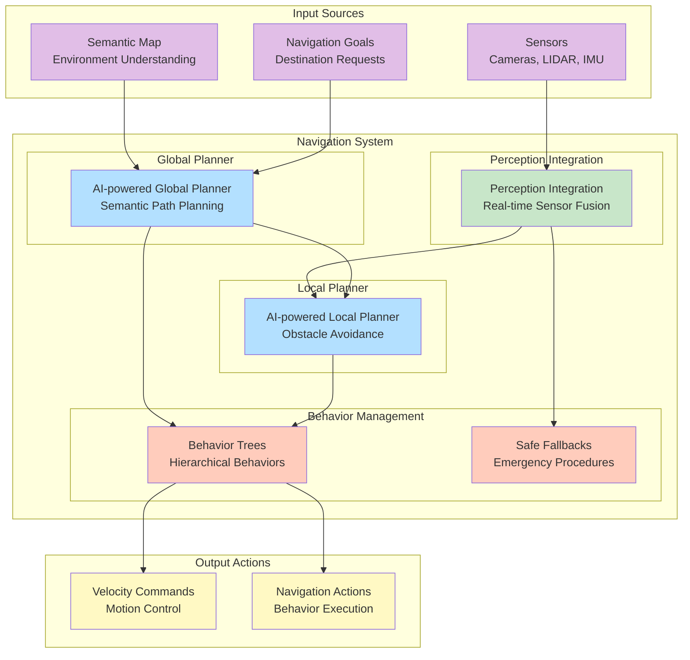

### 3.2 Perception-Integrated Navigation
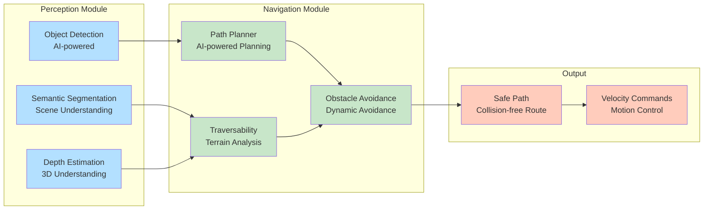

## 4. Isaac Manipulation Architecture

### 4.1 Isaac Manipulation Framework
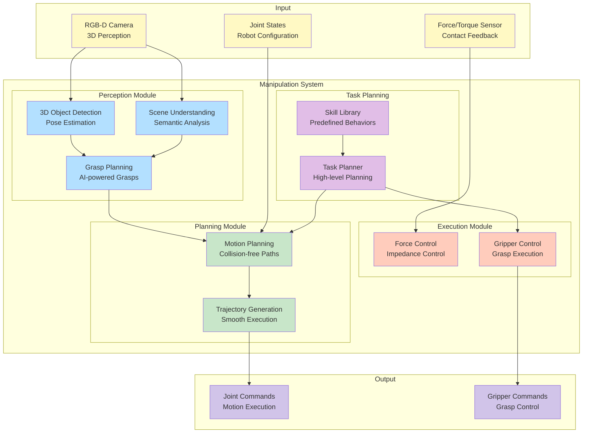

### 4.2 AI-Enhanced Manipulation
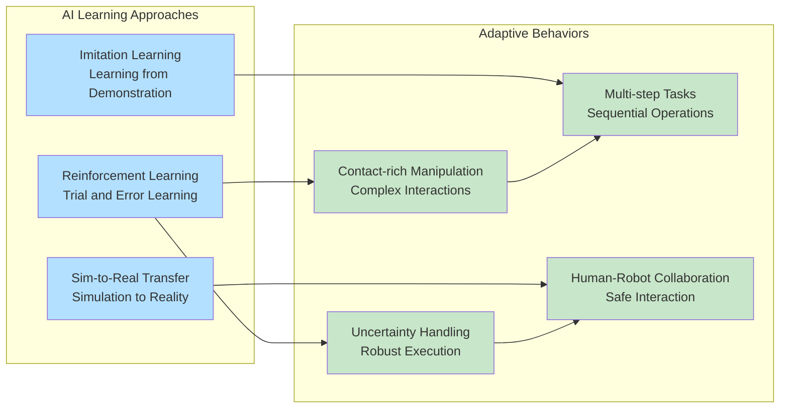

## 5. Deep Learning Integration

### 5.1 TensorRT Optimization Pipeline
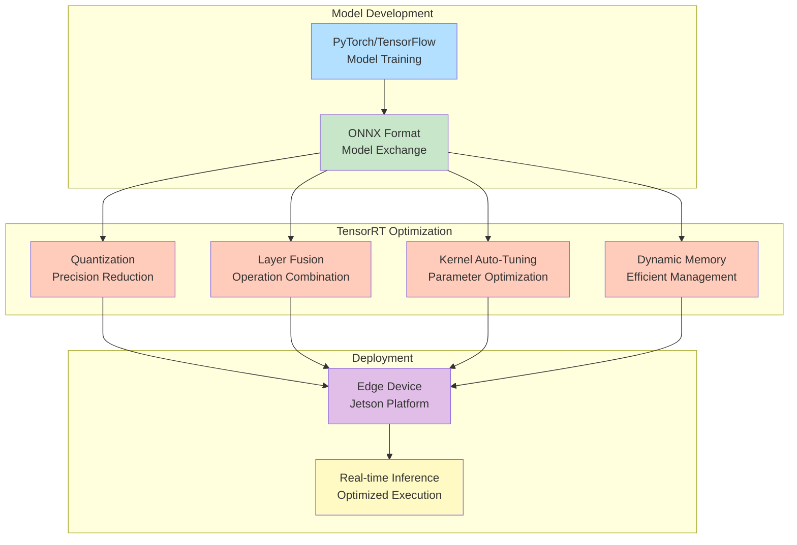

### 5.2 AI Model Integration in Isaac
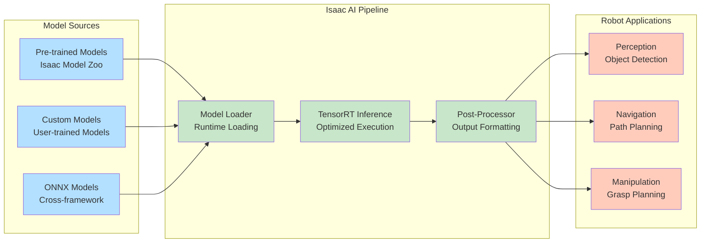

## 6. Hardware Integration

### 6.1 NVIDIA Hardware Platforms for Isaac
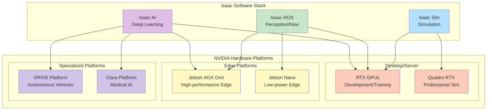

### 6.2 Performance Optimization Architecture
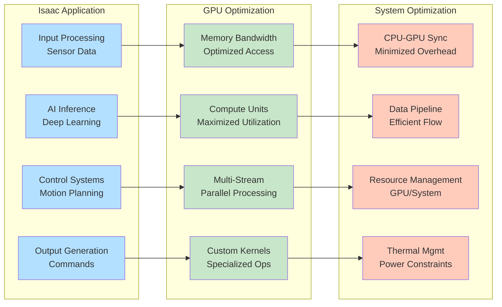

## 7. Isaac Sim to Real Robot Workflow

### 7.1 Simulation to Reality Pipeline
```mermaid
graph TD
    subgraph "Simulation Phase"
        Design[Robot Design<br/>URDF/SDF Models]
        SimEnv[Simulation Environment<br/>Isaac Sim World]
        Train[AI Training<br/>Synthetic Data]
        Test[Behavior Testing<br/>Virtual Scenarios]
    end

    subgraph "Transfer Phase"
        DomainRnd[Domain Randomization<br/>Reality Gap Reduction]
        Validation[Validation<br/>Simulation Performance]
        Deployment[Deployment Preparation<br/>Hardware Optimization]
    end

    subgraph "Reality Phase"
        RealRobot[Real Robot<br/>Physical Hardware]
        RealSensors[Real Sensors<br/>Physical Perception]
        RealControl[Real Control<br/>Physical Execution]
        RealEval[Real Evaluation<br/>Performance Assessment]
    end

    Design --> SimEnv
    SimEnv --> Train
    Train --> Test
    Test --> DomainRnd
    DomainRnd --> Validation
    Validation --> Deployment
    Deployment --> RealRobot
    RealRobot --> RealSensors
    RealSensors --> RealControl
    RealControl --> RealEval
    RealEval --> Validation  # Feedback loop

    style Design fill:#b3e0ff
    style SimEnv fill:#b3e0ff
    style Train fill:#b3e0ff
    style Test fill:#b3e0ff
    style DomainRnd fill:#c8e6c9
    style Validation fill:#c8e6c9
    style Deployment fill:#c8e6c9
    style RealRobot fill:#ffccbc
    style RealSensors fill:#ffccbc
    style RealControl fill:#ffccbc
    style RealEval fill:#ffccbc
```

These diagrams provide visual representations of key NVIDIA Isaac platform concepts, architecture, and integration patterns relevant to Physical AI systems, helping to understand the complex relationships between simulation, perception, navigation, manipulation, and AI components in the Isaac ecosystem.