# Diagrams: Humanoid Robotics and Locomotion

## 1. Humanoid Robot Architecture

### 1.1 Humanoid Robot Kinematic Structure
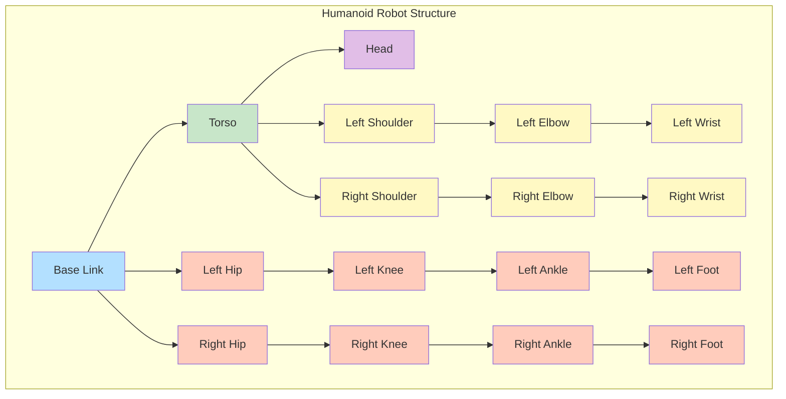

### 1.2 Degrees of Freedom in Humanoid Robot
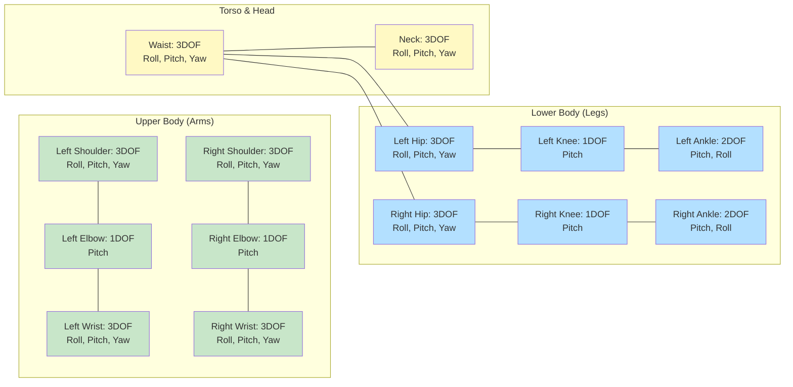

## 2. Biomechanics and Human Locomotion

### 2.1 Human Gait Cycle Phases
```mermaid
gantt
    title Human Gait Cycle Phases
    dateFormat X
    axisFormat %s

    section Stance Phase
    Heel Strike           :HS, 0, 0.08
    Loading Response      :LR, 0.08, 0.18
    Mid Stance            :MS, 0.18, 0.30
    Terminal Stance       :TS, 0.30, 0.50

    section Swing Phase
    Pre-swing             :PS, 0.50, 0.60
    Initial Swing         :IS, 0.60, 0.73
    Mid Swing             :MSw, 0.73, 0.87
    Terminal Swing        :TSw, 0.87, 1.00

    section Support Type
    Single Support        :SS, 0.0, 0.60
    Double Support        :DS, 0.60, 0.62
    Single Support 2      :SS2, 0.62, 1.00
```

### 2.2 Inverted Pendulum Model
```mermaid
graph TD
    subgraph "Inverted Pendulum Model"
        CoM[Center of Mass<br/>Mass = m]
        Support[Support Point<br/>Foot Contact]
        ZMP[Zero Moment Point<br/>ZMP = CoM - (h/g)*CoM_ddot]
        CoP[Center of Pressure<br/>Under Foot]
    end

    CoM --- Support
    Support --- ZMP
    Support --- CoP

    subgraph "Balance Control"
        Feedback[Feedback Control<br/>Adjust CoM Position]
        AnkleStrategy[Ankle Strategy<br/>Ankle Torque]
        HipStrategy[Hip Strategy<br/>Hip Torque]
        StepStrategy[Step Strategy<br/>Foot Placement]
    end

    ZMP -.-> Feedback
    Feedback -.-> AnkleStrategy
    Feedback -.-> HipStrategy
    Feedback -.-> StepStrategy

    style CoM fill:#b3e0ff
    style Support fill:#c8e6c9
    style ZMP fill:#ffccbc
    style CoP fill:#ffccbc
    style Feedback fill:#e1bee7
    style AnkleStrategy fill:#fff9c4
    style HipStrategy fill:#fff9c4
    style StepStrategy fill:#fff9c4
```

### 2.3 Capture Point Concept
```mermaid
graph LR
    subgraph "Balance Control with Capture Point"
        CoM[Current CoM<br/>Position and Velocity]
        CoMVelocity[CoM Velocity<br/>v = dx/dt]
        Gravity[Gravity<br/>g = 9.81 m/s²]
        CoMHeight[CoM Height<br/>h]
    end

    subgraph "Capture Point Calculation"
        Omega[w = √(g/h)<br/>Natural Frequency]
        CapturePoint[Capture Point<br/>CP = CoM + v/w]
    end

    subgraph "Balance Strategies"
        StepLocation[Required Step Location<br/>At Capture Point]
        CoMAdjustment[CoM Adjustment<br/>Modify Trajectory]
        AnkleControl[Ankle Control<br/>Maintain Balance]
    end

    CoM --> CapturePoint
    CoMVelocity --> CapturePoint
    Gravity --> Omega
    CoMHeight --> Omega
    Omega --> CapturePoint
    CapturePoint --> StepLocation
    CapturePoint --> CoMAdjustment
    CapturePoint --> AnkleControl

    style CoM fill:#b3e0ff
    style CoMVelocity fill:#b3e0ff
    style Gravity fill:#c8e6c9
    style CoMHeight fill:#c8e6c9
    style Omega fill:#e1bee7
    style CapturePoint fill:#ffccbc
    style StepLocation fill:#fff9c4
    style CoMAdjustment fill:#fff9c4
    style AnkleControl fill:#fff9c4
```

## 3. Balance Control Systems

### 3.1 ZMP-Based Balance Control Architecture
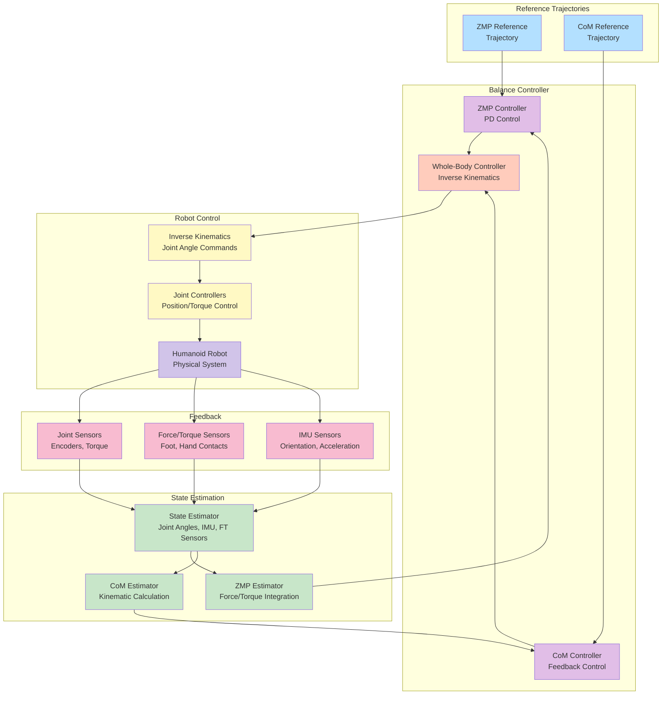

### 3.2 Balance Control Strategies
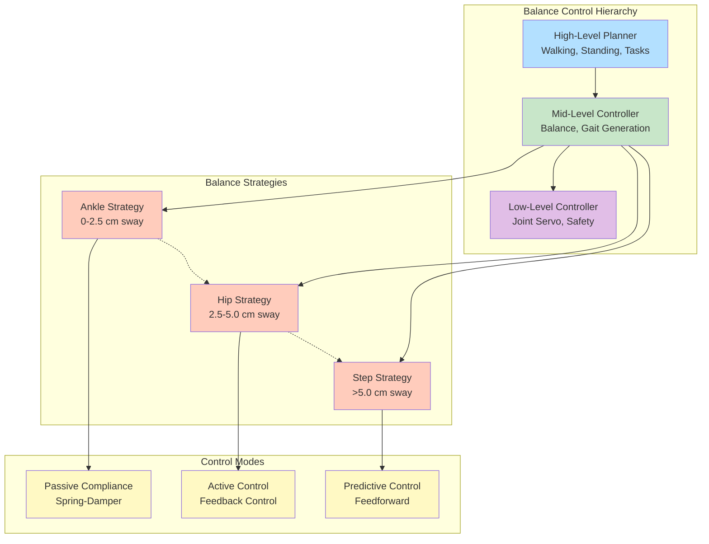

## 4. Walking Gait Generation

### 4.1 Walking Pattern Generation Process
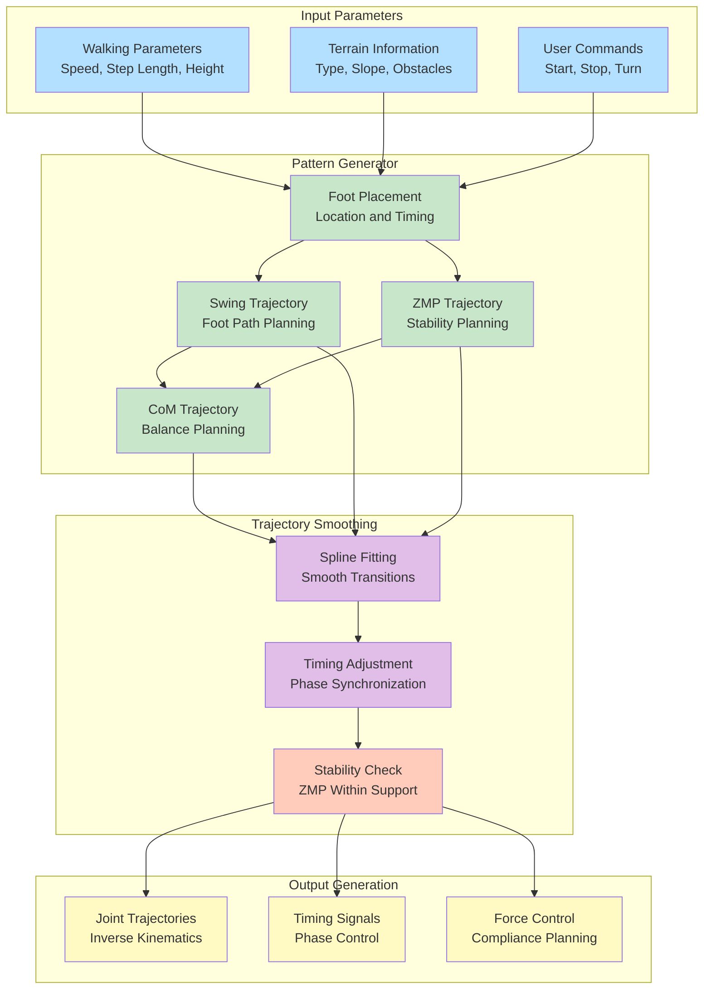

### 4.2 Walking Gait Phases and Control
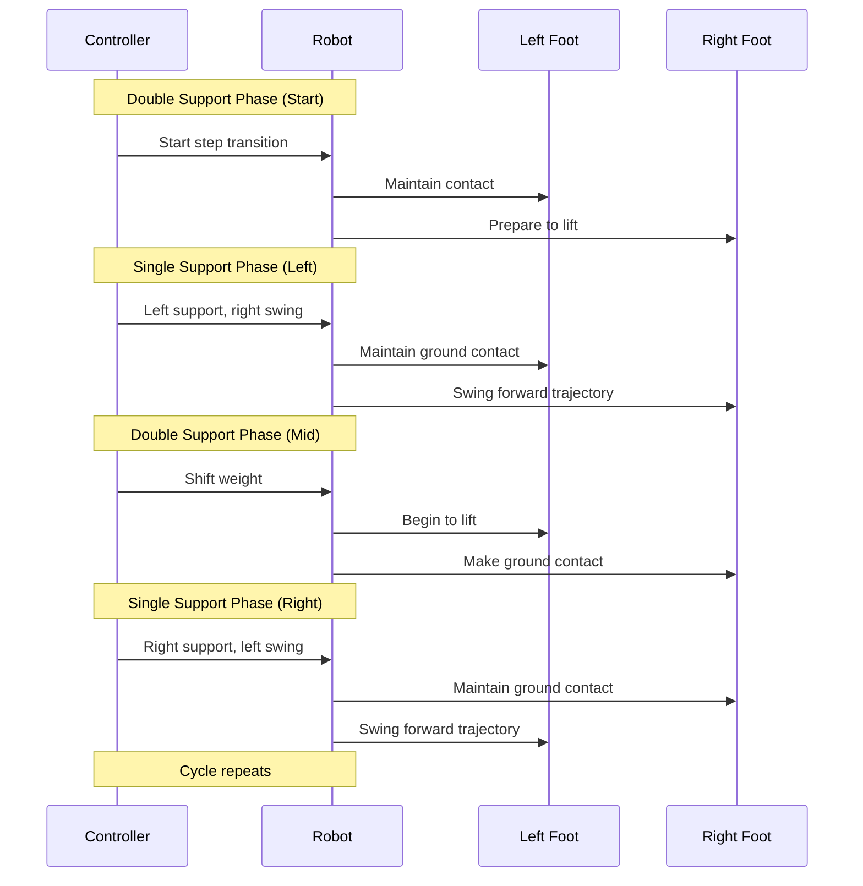

## 5. Control Systems Architecture

### 5.1 Hierarchical Control Architecture
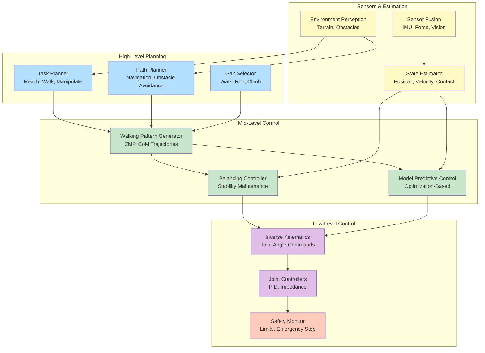

### 5.2 Whole-Body Control Framework
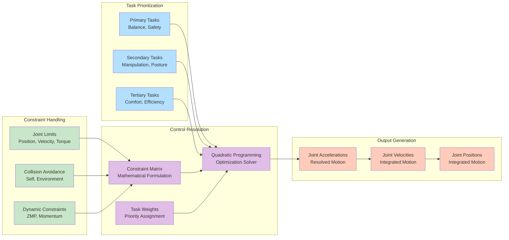

## 6. AI and Machine Learning Integration

### 6.1 Reinforcement Learning for Gait Optimization
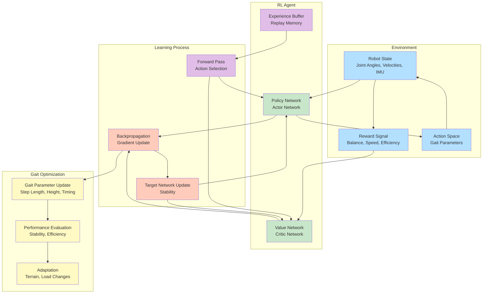

### 6.2 Imitation Learning from Human Demonstrations
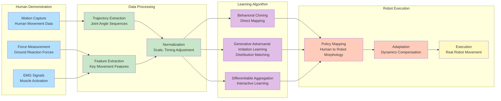

## 7. Safety and Human-Robot Interaction

### 7.1 Safety Architecture for Humanoid Robots
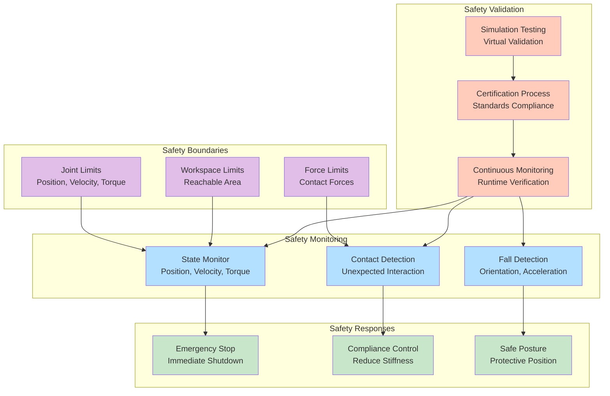

### 7.2 Human-Robot Interaction Framework
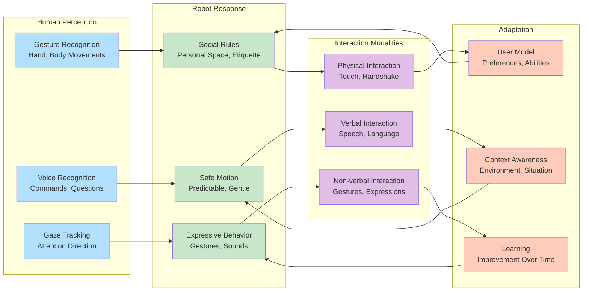

These diagrams provide visual representations of key humanoid robotics concepts, including robot architecture, balance control systems, walking gait generation, control architectures, AI integration, and safety frameworks, helping to understand the complex relationships between different components in humanoid robot systems.