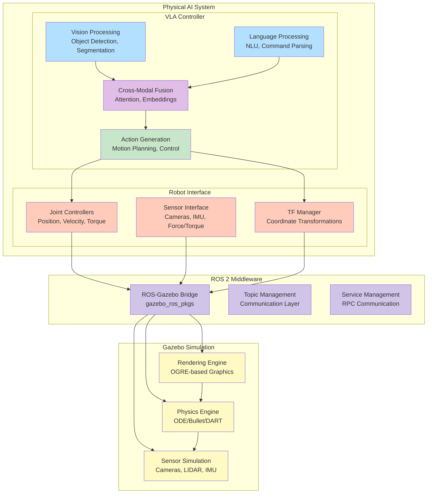
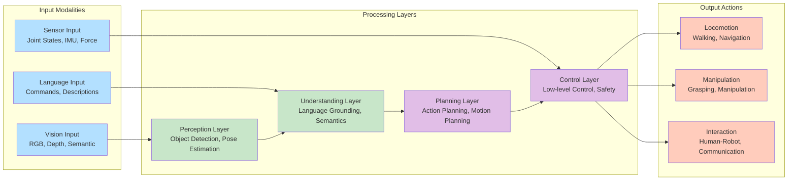
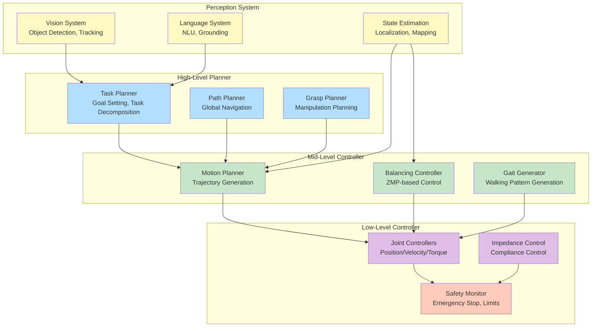

# Code Examples: Vision-Language-Action Systems

## 1. Vision-Language Integration

### 1.1 Vision-Language Encoder (CLIP-style)

```python
#!/usr/bin/env python3
"""
Vision-Language encoder for VLA systems using CLIP-style architecture
"""
import torch
import torch.nn as nn
import torchvision.transforms as transforms
from transformers import CLIPProcessor, CLIPModel
import numpy as np


class VisionLanguageEncoder(nn.Module):
    def __init__(self, embed_dim=512, vision_width=768, text_width=512):
        super().__init__()

        # Vision encoder (using ViT backbone)
        self.vision_encoder = nn.Sequential(
            nn.Conv2d(3, 64, kernel_size=7, stride=2, padding=3),
            nn.BatchNorm2d(64),
            nn.ReLU(inplace=True),
            nn.MaxPool2d(kernel_size=3, stride=2, padding=1),
            nn.Conv2d(64, 128, kernel_size=3, stride=2, padding=1),
            nn.BatchNorm2d(128),
            nn.ReLU(inplace=True),
            nn.AdaptiveAvgPool2d((1, 1)),
            nn.Flatten(),
            nn.Linear(128, vision_width),
            nn.LayerNorm(vision_width),
            nn.ReLU(inplace=True),
            nn.Linear(vision_width, embed_dim)
        )

        # Text encoder (simplified transformer)
        self.text_encoder = nn.Sequential(
            nn.Embedding(50000, text_width),  # 50k vocab
            nn.TransformerEncoder(
                nn.TransformerEncoderLayer(
                    d_model=text_width,
                    nhead=8,
                    dim_feedforward=text_width * 4
                ),
                num_layers=6
            ),
            nn.AdaptiveAvgPool1d(1),
            nn.Flatten(),
            nn.Linear(text_width, embed_dim)
        )

        # Projection layers for multimodal fusion
        self.vision_projection = nn.Linear(embed_dim, embed_dim)
        self.text_projection = nn.Linear(embed_dim, embed_dim)

        # Temperature parameter for contrastive learning
        self.logit_scale = nn.Parameter(torch.ones([]) * np.log(1 / 0.07))

    def forward_vision(self, images):
        """Encode visual features"""
        vision_features = self.vision_encoder(images)
        vision_features = self.vision_projection(vision_features)
        vision_features = vision_features / vision_features.norm(dim=-1, keepdim=True)
        return vision_features

    def forward_text(self, text_tokens):
        """Encode text features"""
        text_features = self.text_encoder(text_tokens)
        text_features = self.text_projection(text_features)
        text_features = text_features / text_features.norm(dim=-1, keepdim=True)
        return text_features

    def forward(self, images, text_tokens):
        """Forward pass for both modalities"""
        vision_features = self.forward_vision(images)
        text_features = self.forward_text(text_tokens)

        # Compute similarity logits
        logit_scale = self.logit_scale.exp()
        logits_per_image = torch.matmul(vision_features, text_features.t()) * logit_scale
        logits_per_text = logits_per_image.t()

        return {
            'vision_features': vision_features,
            'text_features': text_features,
            'logits_per_image': logits_per_image,
            'logits_per_text': logits_per_text
        }


class VisionLanguageGrounding(nn.Module):
    def __init__(self, encoder, max_objects=10):
        super().__init__()
        self.encoder = encoder
        self.max_objects = max_objects

        # Object detection head
        self.object_detection_head = nn.Sequential(
            nn.Linear(512, 256),
            nn.ReLU(),
            nn.Dropout(0.1),
            nn.Linear(256, max_objects * 6)  # [x, y, w, h, confidence, class] per object
        )

        # Cross-modal attention for grounding
        self.cross_attention = nn.MultiheadAttention(
            embed_dim=512, num_heads=8, dropout=0.1
        )

        # Language-conditioned feature extractor
        self.conditioned_extractor = nn.Sequential(
            nn.Linear(1024, 512),  # Combined vision-text features
            nn.ReLU(),
            nn.Linear(512, 512)
        )

    def forward(self, images, language_command):
        """Ground language command to visual objects"""
        # Encode vision and language
        encoded = self.encoder(images, language_command)
        vision_features = encoded['vision_features']
        text_features = encoded['text_features']

        # Detect objects in image
        object_detections = self.detect_objects(vision_features)

        # Ground language to objects using cross-attention
        grounded_features = self.ground_language_to_objects(
            vision_features, text_features, object_detections
        )

        return {
            'object_detections': object_detections,
            'grounded_features': grounded_features,
            'vision_features': vision_features,
            'text_features': text_features
        }

    def detect_objects(self, vision_features):
        """Detect objects in the scene"""
        object_outputs = self.object_detection_head(vision_features)
        # Reshape to [batch, max_objects, 6]
        object_outputs = object_outputs.view(-1, self.max_objects, 6)

        # Apply sigmoid to confidence scores
        object_outputs[:, :, 4] = torch.sigmoid(object_outputs[:, :, 4])  # confidence
        object_outputs[:, :, 5] = torch.softmax(object_outputs[:, :, 5], dim=-1)  # class probabilities

        return object_outputs

    def ground_language_to_objects(self, vision_features, text_features, object_detections):
        """Ground language command to detected objects"""
        # Combine vision and text features
        combined_features = torch.cat([vision_features, text_features], dim=-1)

        # Extract object features from detections
        object_features = self.extract_object_features(object_detections, vision_features)

        # Apply cross-modal attention
        attended_features, attention_weights = self.cross_attention(
            object_features.unsqueeze(1),  # query
            text_features.unsqueeze(1),    # key
            text_features.unsqueeze(1)     # value
        )

        # Condition object features on language
        conditioned_features = self.conditioned_extractor(
            torch.cat([attended_features.squeeze(1), text_features], dim=-1)
        )

        return conditioned_features

    def extract_object_features(self, detections, vision_features):
        """Extract features for detected objects"""
        # This is a simplified version - in practice, you'd use ROI pooling
        # or similar techniques to extract features for specific regions
        batch_size = detections.size(0)
        num_objects = detections.size(1)

        # Use the overall vision features as proxy for object features
        # (in practice, use region-specific features)
        object_features = vision_features.unsqueeze(1).expand(-1, num_objects, -1)

        return object_features


def create_clip_vla_model():
    """Create and return a CLIP-based VLA model"""
    encoder = VisionLanguageEncoder()
    grounding_module = VisionLanguageGrounding(encoder)

    return nn.Sequential(
        nn.ModuleDict({
            'encoder': encoder,
            'grounding': grounding_module
        })
    )


# Example usage
if __name__ == "__main__":
    # Create model
    model = VisionLanguageGrounding(VisionLanguageEncoder())

    # Example inputs
    batch_size = 4
    image_tensor = torch.randn(batch_size, 3, 224, 224)  # RGB image
    text_tokens = torch.randint(0, 50000, (batch_size, 16))  # Text tokens

    # Forward pass
    result = model(image_tensor, text_tokens)

    print("Vision-Language Grounding Results:")
    print(f"Object detections shape: {result['object_detections'].shape}")
    print(f"Grounded features shape: {result['grounded_features'].shape}")
    print(f"Vision features shape: {result['vision_features'].shape}")
    print(f"Text features shape: {result['text_features'].shape}")
```

### 1.2 Cross-Modal Attention Module

```python
#!/usr/bin/env python3
"""
Cross-modal attention for vision-language integration in VLA systems
"""
import torch
import torch.nn as nn
import torch.nn.functional as F


class CrossModalAttention(nn.Module):
    def __init__(self, hidden_dim=512, num_heads=8):
        super().__init__()

        assert hidden_dim % num_heads == 0, "hidden_dim must be divisible by num_heads"

        self.hidden_dim = hidden_dim
        self.num_heads = num_heads
        self.head_dim = hidden_dim // num_heads
        self.scale = self.head_dim ** -0.5

        # Linear projections for Q, K, V from both modalities
        self.vision_q_proj = nn.Linear(hidden_dim, hidden_dim)
        self.vision_k_proj = nn.Linear(hidden_dim, hidden_dim)
        self.vision_v_proj = nn.Linear(hidden_dim, hidden_dim)

        self.text_q_proj = nn.Linear(hidden_dim, hidden_dim)
        self.text_k_proj = nn.Linear(hidden_dim, hidden_dim)
        self.text_v_proj = nn.Linear(hidden_dim, hidden_dim)

        # Output projection
        self.out_proj = nn.Linear(hidden_dim, hidden_dim)

        # Layer normalization
        self.norm = nn.LayerNorm(hidden_dim)

    def forward(self, vision_features, text_features, attention_mask=None):
        """
        Forward pass for cross-modal attention

        Args:
            vision_features: [batch_size, seq_len_vision, hidden_dim]
            text_features: [batch_size, seq_len_text, hidden_dim]
            attention_mask: [batch_size, seq_len_vision, seq_len_text] (optional)

        Returns:
            attended_features: [batch_size, seq_len_vision, hidden_dim]
        """
        batch_size = vision_features.size(0)

        # Project vision features for attention
        vision_q = self.vision_q_proj(vision_features).view(
            batch_size, -1, self.num_heads, self.head_dim
        ).transpose(1, 2)
        vision_k = self.vision_k_proj(vision_features).view(
            batch_size, -1, self.num_heads, self.head_dim
        ).transpose(1, 2)
        vision_v = self.vision_v_proj(vision_features).view(
            batch_size, -1, self.num_heads, self.head_dim
        ).transpose(1, 2)

        # Project text features for attention
        text_k = self.text_k_proj(text_features).view(
            batch_size, -1, self.num_heads, self.head_dim
        ).transpose(1, 2)
        text_v = self.text_v_proj(text_features).view(
            batch_size, -1, self.num_heads, self.head_dim
        ).transpose(1, 2)

        # Compute attention scores: vision attending to text
        attention_scores = torch.matmul(vision_q, text_k.transpose(-2, -1)) * self.scale

        # Apply attention mask if provided
        if attention_mask is not None:
            attention_scores = attention_scores.masked_fill(
                attention_mask == 0, float('-inf')
            )

        # Apply softmax to get attention weights
        attention_weights = F.softmax(attention_scores, dim=-1)

        # Apply attention to values
        attended_features = torch.matmul(attention_weights, text_v)

        # Reshape back to original dimensions
        attended_features = attended_features.transpose(1, 2).contiguous().view(
            batch_size, -1, self.hidden_dim
        )

        # Apply output projection and normalization
        attended_features = self.out_proj(attended_features)
        attended_features = self.norm(attended_features + vision_features)

        return attended_features, attention_weights


class MultimodalFusion(nn.Module):
    def __init__(self, hidden_dim=512, fusion_type='concat'):
        super().__init__()

        self.fusion_type = fusion_type
        self.hidden_dim = hidden_dim

        if fusion_type == 'concat':
            self.fusion_layer = nn.Sequential(
                nn.Linear(hidden_dim * 2, hidden_dim * 2),
                nn.ReLU(),
                nn.Dropout(0.1),
                nn.Linear(hidden_dim * 2, hidden_dim),
                nn.LayerNorm(hidden_dim)
            )
        elif fusion_type == 'additive':
            self.vision_weight = nn.Parameter(torch.ones(1))
            self.text_weight = nn.Parameter(torch.ones(1))
            self.norm = nn.LayerNorm(hidden_dim)
        elif fusion_type == 'gated':
            # Gate-based fusion
            self.gate_net = nn.Sequential(
                nn.Linear(hidden_dim * 2, hidden_dim),
                nn.Sigmoid()
            )
            self.fusion_transform = nn.Linear(hidden_dim * 2, hidden_dim)
            self.norm = nn.LayerNorm(hidden_dim)
        else:
            raise ValueError(f"Unknown fusion type: {fusion_type}")

    def forward(self, vision_features, text_features):
        """Fuse vision and text features"""
        if self.fusion_type == 'concat':
            combined_features = torch.cat([vision_features, text_features], dim=-1)
            fused_features = self.fusion_layer(combined_features)
        elif self.fusion_type == 'additive':
            # Weighted sum of features
            weighted_vision = self.vision_weight * vision_features
            weighted_text = self.text_weight * text_features
            fused_features = weighted_vision + weighted_text
            fused_features = self.norm(fused_features)
        elif self.fusion_type == 'gated':
            # Gate-based combination
            combined_input = torch.cat([vision_features, text_features], dim=-1)
            gate = self.gate_net(combined_input)
            combined_features = torch.cat([vision_features, text_features], dim=-1)
            gated_combined = gate * combined_features
            fused_features = self.fusion_transform(gated_combined)
            fused_features = self.norm(fused_features)

        return fused_features


class VisionLanguageFusion(nn.Module):
    def __init__(self, hidden_dim=512):
        super().__init__()

        self.cross_attention = CrossModalAttention(hidden_dim)
        self.multimodal_fusion = MultimodalFusion(hidden_dim, fusion_type='gated')

        # Feature extractors for each modality
        self.vision_feature_extractor = nn.Sequential(
            nn.Linear(512, hidden_dim),
            nn.ReLU(),
            nn.Linear(hidden_dim, hidden_dim)
        )

        self.text_feature_extractor = nn.Sequential(
            nn.Linear(512, hidden_dim),
            nn.ReLU(),
            nn.Linear(hidden_dim, hidden_dim)
        )

    def forward(self, vision_input, text_input, attention_mask=None):
        """Forward pass for vision-language fusion"""
        # Extract features for each modality
        vision_features = self.vision_feature_extractor(vision_input)
        text_features = self.text_feature_extractor(text_input)

        # Apply cross-modal attention (vision attending to text)
        attended_vision, attention_weights = self.cross_attention(
            vision_features, text_features, attention_mask
        )

        # Fuse the attended vision with original text features
        fused_features = self.multimodal_fusion(attended_vision, text_features)

        return {
            'fused_features': fused_features,
            'attended_vision': attended_vision,
            'attention_weights': attention_weights,
            'vision_features': vision_features,
            'text_features': text_features
        }


# Example usage
if __name__ == "__main__":
    # Create model
    model = VisionLanguageFusion(hidden_dim=256)

    # Example inputs
    batch_size = 4
    seq_len_vision = 100  # e.g., number of image patches
    seq_len_text = 16     # e.g., number of text tokens

    vision_input = torch.randn(batch_size, seq_len_vision, 512)
    text_input = torch.randn(batch_size, seq_len_text, 512)

    # Forward pass
    result = model(vision_input, text_input)

    print("Vision-Language Fusion Results:")
    print(f"Fused features shape: {result['fused_features'].shape}")
    print(f"Attended vision shape: {result['attended_vision'].shape}")
    print(f"Attention weights shape: {result['attention_weights'].shape}")
```

## 2. Language Processing for VLA Systems

### 2.1 Natural Language Command Parser

```python
#!/usr/bin/env python3
"""
Natural language command parser for VLA systems
"""
import torch
import torch.nn as nn
import re
from typing import Dict, List, Tuple, Optional


class NLCommandParser(nn.Module):
    def __init__(self, vocab_size=50000, embed_dim=256, hidden_dim=512):
        super().__init__()

        # Word embedding layer
        self.embedding = nn.Embedding(vocab_size, embed_dim)

        # LSTM for sequence processing
        self.lstm = nn.LSTM(
            input_size=embed_dim,
            hidden_size=hidden_dim,
            num_layers=2,
            batch_first=True,
            dropout=0.1
        )

        # Action classifier
        self.action_classifier = nn.Sequential(
            nn.Linear(hidden_dim, hidden_dim // 2),
            nn.ReLU(),
            nn.Dropout(0.1),
            nn.Linear(hidden_dim // 2, 20)  # 20 different action types
        )

        # Object detector in text
        self.object_detector = nn.Sequential(
            nn.Linear(hidden_dim, hidden_dim // 2),
            nn.ReLU(),
            nn.Dropout(0.1),
            nn.Linear(hidden_dim // 2, 100)  # 100 different object types
        )

        # Spatial relation classifier
        self.spatial_classifier = nn.Sequential(
            nn.Linear(hidden_dim, hidden_dim // 2),
            nn.ReLU(),
            nn.Dropout(0.1),
            nn.Linear(hidden_dim // 2, 10)  # 10 different spatial relations
        )

        # Position classifier (for sequence labeling)
        self.position_classifier = nn.Linear(hidden_dim, 5)  # BIOES tagging

        # Vocabulary mapping (simplified)
        self.word_to_idx = self._build_vocabulary()
        self.idx_to_action = {
            0: 'move_forward', 1: 'move_backward', 2: 'turn_left', 3: 'turn_right',
            4: 'pick_up', 5: 'put_down', 6: 'grasp', 7: 'release',
            8: 'navigate_to', 9: 'inspect', 10: 'avoid', 11: 'stop',
            12: 'open', 13: 'close', 14: 'push', 15: 'pull',
            16: 'lift', 17: 'lower', 18: 'rotate', 19: 'wait'
        }

        self.idx_to_spatial = {
            0: 'left', 1: 'right', 2: 'front', 3: 'behind',
            4: 'above', 5: 'below', 6: 'near', 7: 'far',
            8: 'between', 9: 'inside'
        }

    def _build_vocabulary(self):
        """Build a simple vocabulary for common robot commands"""
        common_words = [
            'the', 'a', 'an', 'and', 'or', 'but', 'in', 'on', 'at', 'to',
            'for', 'of', 'with', 'by', 'from', 'up', 'down', 'left', 'right',
            'forward', 'backward', 'move', 'go', 'come', 'get', 'take', 'pick',
            'put', 'place', 'drop', 'grasp', 'hold', 'carry', 'bring', 'give',
            'look', 'see', 'find', 'locate', 'inspect', 'examine', 'check',
            'red', 'blue', 'green', 'yellow', 'large', 'small', 'big', 'little',
            'square', 'round', 'circular', 'rectangular', 'box', 'cup', 'bottle',
            'table', 'chair', 'door', 'window', 'room', 'kitchen', 'bedroom',
            'please', 'now', 'slowly', 'carefully', 'quickly', 'fast', 'stop',
            'yes', 'no', 'okay', 'done', 'finished', 'complete', 'ready'
        ]

        vocab = {'<PAD>': 0, '<UNK>': 1, '<START>': 2, '<END>': 3}
        for i, word in enumerate(common_words, 4):
            vocab[word.lower()] = i

        return vocab

    def tokenize_command(self, command: str) -> List[int]:
        """Convert command string to token indices"""
        # Simple tokenization
        tokens = re.findall(r'\b\w+\b|[^\w\s]', command.lower())
        token_indices = [self.word_to_idx.get(token, self.word_to_idx['<UNK>']) for token in tokens]
        return token_indices

    def forward(self, commands: List[str]):
        """
        Parse natural language commands

        Args:
            commands: List of command strings

        Returns:
            Dictionary with parsed components
        """
        # Tokenize commands
        tokenized_commands = [self.tokenize_command(cmd) for cmd in commands]

        # Pad sequences to same length
        max_len = max(len(tokens) for tokens in tokenized_commands)
        padded_tokens = []
        attention_masks = []

        for tokens in tokenized_commands:
            padded = tokens + [self.word_to_idx['<PAD>']] * (max_len - len(tokens))
            mask = [1] * len(tokens) + [0] * (max_len - len(tokens))
            padded_tokens.append(padded)
            attention_masks.append(mask)

        # Convert to tensors
        token_tensor = torch.tensor(padded_tokens, dtype=torch.long)
        attention_mask = torch.tensor(attention_masks, dtype=torch.bool)

        # Embed tokens
        embedded = self.embedding(token_tensor)

        # Process with LSTM
        lstm_output, (hidden, cell) = self.lstm(embedded)

        # Use last hidden state for classification
        last_hidden = hidden[-1]  # Take last layer

        # Classify action
        action_logits = self.action_classifier(last_hidden)
        action_probs = torch.softmax(action_logits, dim=-1)

        # Classify objects in sequence
        object_logits = self.object_detector(lstm_output)
        object_probs = torch.softmax(object_logits, dim=-1)

        # Classify spatial relations
        spatial_logits = self.spatial_classifier(last_hidden)
        spatial_probs = torch.softmax(spatial_logits, dim=-1)

        # Position tagging (BIOES scheme)
        position_logits = self.position_classifier(lstm_output)
        position_probs = torch.softmax(position_logits, dim=-1)

        return {
            'action_probs': action_probs,
            'object_probs': object_probs,
            'spatial_probs': spatial_probs,
            'position_probs': position_probs,
            'lstm_output': lstm_output,
            'attention_mask': attention_mask
        }

    def parse_command_detailed(self, command: str) -> Dict:
        """Parse a single command and return detailed structure"""
        # Forward pass
        batch_result = self.forward([command])

        # Get results for the single command
        action_probs = batch_result['action_probs'][0]
        object_probs = batch_result['object_probs'][0]
        spatial_probs = batch_result['spatial_probs'][0]

        # Extract most likely action
        action_idx = torch.argmax(action_probs).item()
        action = self.idx_to_action.get(action_idx, 'unknown')

        # Extract objects (simplified - in practice, use sequence tagging)
        object_tokens = self.tokenize_command(command)
        object_names = [list(self.word_to_idx.keys())[idx] for idx in object_tokens if idx in self.word_to_idx.values()]

        # Extract spatial relations
        spatial_idx = torch.argmax(spatial_probs).item()
        spatial_relation = self.idx_to_spatial.get(spatial_idx, 'unknown')

        # Parse numeric quantities (simplified)
        numbers = re.findall(r'\d+\.?\d*', command)
        quantities = [float(num) for num in numbers]

        return {
            'command': command,
            'action': action,
            'objects': object_names,
            'spatial_relation': spatial_relation,
            'quantities': quantities,
            'action_confidence': action_probs[action_idx].item(),
            'parsed_structure': self._create_structured_command(
                action, object_names, spatial_relation, quantities
            )
        }

    def _create_structured_command(self, action: str, objects: List[str],
                                 spatial_relation: str, quantities: List[float]) -> Dict:
        """Create structured command representation"""
        structured = {
            'action_type': action,
            'arguments': {},
            'constraints': {}
        }

        # Map action to arguments
        if action in ['move_forward', 'move_backward', 'move_left', 'move_right']:
            structured['arguments']['distance'] = quantities[0] if quantities else 1.0
        elif action in ['turn_left', 'turn_right']:
            structured['arguments']['angle'] = quantities[0] if quantities else 90.0
        elif action in ['pick_up', 'grasp', 'take']:
            structured['arguments']['target_object'] = objects[0] if objects else 'object'
        elif action in ['put_down', 'place']:
            structured['arguments']['target_object'] = objects[0] if objects else 'object'
            structured['arguments']['location'] = objects[1] if len(objects) > 1 else 'ground'
        elif action in ['navigate_to']:
            structured['arguments']['destination'] = objects[0] if objects else 'location'

        # Add spatial constraints
        if spatial_relation != 'unknown':
            structured['constraints']['spatial_relation'] = spatial_relation

        return structured


class CommandGrounding(nn.Module):
    def __init__(self, command_parser: NLCommandParser, vision_language_model):
        super().__init__()
        self.command_parser = command_parser
        self.vision_language_model = vision_language_model

        # Command grounding network
        self.grounding_network = nn.Sequential(
            nn.Linear(512 + 256, 512),  # Combined vision-text + command features
            nn.ReLU(),
            nn.Dropout(0.1),
            nn.Linear(512, 256),
            nn.ReLU(),
            nn.Linear(256, 10)  # 10 different grounding types
        )

    def forward(self, command: str, vision_features: torch.Tensor):
        """
        Ground command to visual scene

        Args:
            command: Natural language command
            vision_features: Features from visual scene

        Returns:
            Grounding results
        """
        # Parse command
        parsed_command = self.command_parser.parse_command_detailed(command)

        # Get command embeddings (simplified)
        command_tokens = self.command_parser.tokenize_command(command)
        command_tensor = torch.tensor([command_tokens], dtype=torch.long)
        command_embeds = self.command_parser.embedding(command_tensor)

        # Average command embedding
        command_features = torch.mean(command_embeds, dim=1)  # [1, embed_dim]

        # Repeat for each vision feature
        batch_size, num_features, feat_dim = vision_features.shape
        command_features_expanded = command_features.unsqueeze(1).expand(-1, num_features, -1)

        # Combine vision and command features
        combined_features = torch.cat([vision_features, command_features_expanded], dim=-1)

        # Apply grounding network
        grounding_scores = self.grounding_network(combined_features)
        grounding_probs = torch.softmax(grounding_scores, dim=-1)

        return {
            'parsed_command': parsed_command,
            'grounding_scores': grounding_scores,
            'grounding_probs': grounding_probs,
            'vision_features': vision_features
        }


# Example usage
if __name__ == "__main__":
    # Create command parser
    parser = NLCommandParser()

    # Example commands
    commands = [
        "Pick up the red cup on the table",
        "Move forward 2 meters and turn left",
        "Navigate to the kitchen and find the blue bottle",
        "Grasp the box near the chair"
    ]

    # Parse commands
    for cmd in commands:
        result = parser.parse_command_detailed(cmd)
        print(f"\nCommand: {cmd}")
        print(f"Parsed: {result}")

    # Test with vision features
    vision_features = torch.randn(1, 100, 512)  # [batch, num_patches, feat_dim]
    grounding_model = CommandGrounding(parser, None)

    grounding_result = grounding_model(commands[0], vision_features)
    print(f"\nGrounding result shape: {grounding_result['grounding_probs'].shape}")
```

### 2.2 Semantic Role Labeling for Action Commands

```python
#!/usr/bin/env python3
"""
Semantic Role Labeling for action command understanding in VLA systems
"""
import torch
import torch.nn as nn
import torch.nn.functional as F
from typing import Dict, List, Tuple


class SemanticRoleLabeler(nn.Module):
    def __init__(self, hidden_dim=512, num_roles=10):
        super().__init__()

        self.hidden_dim = hidden_dim
        self.num_roles = num_roles

        # BiLSTM for contextual encoding
        self.context_encoder = nn.LSTM(
            input_size=hidden_dim,
            hidden_size=hidden_dim // 2,
            num_layers=2,
            batch_first=True,
            bidirectional=True,
            dropout=0.1
        )

        # Role classifier
        self.role_classifier = nn.Sequential(
            nn.Linear(hidden_dim, hidden_dim // 2),
            nn.ReLU(),
            nn.Dropout(0.1),
            nn.Linear(hidden_dim // 2, num_roles)
        )

        # Predicate (action) classifier
        self.predicate_classifier = nn.Sequential(
            nn.Linear(hidden_dim, hidden_dim // 2),
            nn.ReLU(),
            nn.Dropout(0.1),
            nn.Linear(hidden_dim // 2, 2)  # predicate vs non-predicate
        )

        # Dependency relation classifier
        self.relation_classifier = nn.Sequential(
            nn.Linear(hidden_dim * 2, hidden_dim),  # concatenated features
            nn.ReLU(),
            nn.Dropout(0.1),
            nn.Linear(hidden_dim, 15)  # 15 common dependency relations
        )

        # Role vocabulary
        self.idx_to_role = {
            0: 'ARG0',  # Agent/Actor
            1: 'ARG1',  # Patient/Theme
            2: 'ARG2',  # Recipient/Beneficiary
            3: 'ARG3',  # Instrument
            4: 'ARG4',  # Location
            5: 'ARG5',  # Source
            6: 'ARG6',  # Goal
            7: 'ARG7',  # Manner
            8: 'ARG8',  # Cause
            9: 'ARG9'   # Time
        }

        self.idx_to_relation = {
            0: 'nsubj',    # Nominal subject
            1: 'dobj',     # Direct object
            2: 'iobj',     # Indirect object
            3: 'nmod',     # Nominal modifier
            4: 'advmod',   # Adverbial modifier
            5: 'acl',      # Clausal modifier of noun
            6: 'amod',     # Adjectival modifier
            7: 'compound', # Compound
            8: 'prep',     # Prepositional modifier
            9: 'pobj',     # Object of preposition
            10: 'ccomp',   # Clausal complement
            11: 'xcomp',   # Open clausal complement
            12: 'conj',    # Conjunct
            13: 'cc',      # Coordinating conjunction
            14: 'aux'      # Auxiliary
        }

    def forward(self, command_features: torch.Tensor,
                attention_mask: torch.Tensor = None):
        """
        Forward pass for semantic role labeling

        Args:
            command_features: [batch_size, seq_len, hidden_dim] - token features
            attention_mask: [batch_size, seq_len] - attention mask

        Returns:
            Dictionary with role labels and relations
        """
        # Encode context using BiLSTM
        if attention_mask is not None:
            # Apply mask by setting masked positions to zero
            masked_features = command_features * attention_mask.unsqueeze(-1).float()
            packed_features = nn.utils.rnn.pack_padded_sequence(
                masked_features, attention_mask.sum(dim=1), batch_first=True, enforce_sorted=False
            )
            context_encoded, _ = self.context_encoder(packed_features)
            context_encoded, _ = nn.utils.rnn.pad_packed_sequence(
                context_encoded, batch_first=True, total_length=command_features.size(1)
            )
        else:
            context_encoded, _ = self.context_encoder(command_features)

        # Classify roles for each token
        role_logits = self.role_classifier(context_encoded)
        role_probs = torch.softmax(role_logits, dim=-1)

        # Classify predicates (actions)
        predicate_logits = self.predicate_classifier(context_encoded)
        predicate_probs = torch.softmax(predicate_logits, dim=-1)

        # Classify dependency relations
        # Create pairwise combinations for relation classification
        batch_size, seq_len, feat_dim = context_encoded.shape
        expanded_features = context_encoded.unsqueeze(2).expand(-1, -1, seq_len, -1)
        expanded_features_rev = context_encoded.unsqueeze(1).expand(-1, seq_len, -1, -1)
        combined_features = torch.cat([expanded_features, expanded_features_rev], dim=-1)

        relation_logits = self.relation_classifier(combined_features)
        relation_probs = torch.softmax(relation_logits, dim=-1)

        return {
            'role_probs': role_probs,
            'predicate_probs': predicate_probs,
            'relation_probs': relation_probs,
            'context_encoded': context_encoded
        }

    def extract_semantic_roles(self, command: str, parsed_result: Dict) -> Dict:
        """Extract semantic roles from parsed command"""
        # This would integrate with the command parser
        tokens = command.split()

        # Create mock features for demonstration
        seq_len = len(tokens)
        mock_features = torch.randn(1, seq_len, self.hidden_dim)
        attention_mask = torch.ones(1, seq_len, dtype=torch.bool)

        # Forward pass
        result = self.forward(mock_features, attention_mask)

        # Extract roles based on highest probability
        role_predictions = torch.argmax(result['role_probs'], dim=-1)
        predicate_predictions = torch.argmax(result['predicate_probs'], dim=-1)

        # Create semantic role structure
        semantic_roles = []
        for i, (token, role_idx, pred_idx) in enumerate(
            zip(tokens, role_predictions[0], predicate_predictions[0])
        ):
            role_label = self.idx_to_role.get(role_idx.item(), 'UNKNOWN')
            is_predicate = pred_idx.item() == 1  # predicate vs non-predicate

            semantic_roles.append({
                'token': token,
                'role': role_label,
                'is_predicate': is_predicate,
                'confidence': result['role_probs'][0, i, role_idx].item()
            })

        # Identify predicate-argument structure
        predicates = [i for i, role in enumerate(semantic_roles) if role['is_predicate']]
        arguments = [i for i, role in enumerate(semantic_roles) if not semantic_roles[i]['is_predicate']]

        predicate_argument_pairs = []
        for pred_idx in predicates:
            pred_token = semantic_roles[pred_idx]['token']
            args_for_pred = []

            for arg_idx in arguments:
                # In a real implementation, use dependency relations to connect args to predicates
                args_for_pred.append({
                    'argument_token': semantic_roles[arg_idx]['token'],
                    'role': semantic_roles[arg_idx]['role'],
                    'confidence': semantic_roles[arg_idx]['confidence']
                })

            predicate_argument_pairs.append({
                'predicate': pred_token,
                'arguments': args_for_pred
            })

        return {
            'semantic_roles': semantic_roles,
            'predicate_argument_structure': predicate_argument_pairs,
            'raw_probabilities': result
        }


class ActionGraphBuilder(nn.Module):
    def __init__(self, role_labeler: SemanticRoleLabeler):
        super().__init__()
        self.role_labeler = role_labeler

        # Action graph neural network
        self.graph_builder = nn.Sequential(
            nn.Linear(512, 256),
            nn.ReLU(),
            nn.Dropout(0.1),
            nn.Linear(256, 128),
            nn.ReLU(),
            nn.Linear(128, 64)  # Node and edge features
        )

    def build_action_graph(self, command: str, semantic_roles: Dict) -> Dict:
        """Build action graph from semantic role information"""
        # Extract predicates and arguments
        predicates = []
        arguments = []

        for pair in semantic_roles['predicate_argument_structure']:
            predicate = pair['predicate']
            args = pair['arguments']

            predicates.append({
                'action': predicate,
                'arguments': args
            })

            # Extract arguments for graph nodes
            for arg in args:
                arguments.append({
                    'entity': arg['argument_token'],
                    'role': arg['role'],
                    'type': self._infer_entity_type(arg['argument_token'])
                })

        # Create action graph structure
        action_graph = {
            'nodes': [],
            'edges': [],
            'actions': predicates,
            'entities': arguments
        }

        # Add action nodes
        for i, pred in enumerate(predicates):
            action_graph['nodes'].append({
                'id': f'action_{i}',
                'type': 'action',
                'action': pred['action'],
                'arguments': pred['arguments']
            })

        # Add entity nodes
        for i, arg in enumerate(arguments):
            action_graph['nodes'].append({
                'id': f'entity_{i}',
                'type': 'entity',
                'entity': arg['entity'],
                'role': arg['role'],
                'entity_type': arg['type']
            })

        # Create edges based on predicate-argument relationships
        for i, pred in enumerate(predicates):
            for j, arg in enumerate(arguments):
                # In a real implementation, use more sophisticated edge creation logic
                action_graph['edges'].append({
                    'source': f'action_{i}',
                    'target': f'entity_{j}',
                    'relationship': 'has_argument'
                })

        return action_graph

    def _infer_entity_type(self, entity: str) -> str:
        """Infer entity type from text (simplified)"""
        # Simple heuristics for entity type inference
        if entity in ['table', 'chair', 'desk', 'cabinet', 'shelf']:
            return 'furniture'
        elif entity in ['cup', 'bottle', 'box', 'book', 'phone', 'computer']:
            return 'object'
        elif entity in ['door', 'window', 'handle', 'knob']:
            return 'structure'
        elif entity in ['kitchen', 'bedroom', 'living_room', 'office', 'hall']:
            return 'location'
        elif entity.replace('.', '').replace(',', '').isdigit():
            return 'quantity'
        else:
            return 'other'


# Example usage
if __name__ == "__main__":
    # Create semantic role labeler
    srl = SemanticRoleLabeler()

    # Example commands
    commands = [
        "Pick up the red cup from the table",
        "Move the box to the left of the chair",
        "Open the door near the window"
    ]

    for cmd in commands:
        print(f"\nCommand: {cmd}")

        # Create mock parsed result (in practice, this comes from command parser)
        mock_parsed = {'tokens': cmd.split()}

        # Extract semantic roles
        semantic_roles = srl.extract_semantic_roles(cmd, mock_parsed)

        print("Semantic Roles:")
        for role in semantic_roles['semantic_roles']:
            print(f"  {role['token']}: {role['role']} (pred: {role['is_predicate']}, conf: {role['confidence']:.2f})")

        print("\nPredicate-Argument Structure:")
        for pair in semantic_roles['predicate_argument_structure']:
            print(f"  Predicate: {pair['predicate']}")
            for arg in pair['arguments']:
                print(f"    -> {arg['role']}: {arg['argument_token']} (conf: {arg['confidence']:.2f})")

        # Build action graph
        graph_builder = ActionGraphBuilder(srl)
        action_graph = graph_builder.build_action_graph(cmd, semantic_roles)

        print(f"\nAction Graph: {len(action_graph['nodes'])} nodes, {len(action_graph['edges'])} edges")
        print(f"Actions: {[a['action'] for a in action_graph['actions']]}")
        print(f"Entities: {[e['entity'] for e in action_graph['entities']]}")
```

## 3. Action Planning and Execution

### 3.1 Hierarchical Action Planner

```python
#!/usr/bin/env python3
"""
Hierarchical action planner for VLA systems
"""
import torch
import torch.nn as nn
import numpy as np
from typing import Dict, List, Tuple, Optional
from dataclasses import dataclass


@dataclass
class ActionNode:
    """Represents an action in the hierarchical plan"""
    id: str
    action_type: str
    parameters: Dict
    children: List['ActionNode']
    priority: int = 0
    status: str = 'pending'  # pending, executing, completed, failed


class ActionPlanner(nn.Module):
    def __init__(self, hidden_dim=512):
        super().__init__()

        # Action embedding network
        self.action_embedder = nn.Sequential(
            nn.Linear(hidden_dim, hidden_dim // 2),
            nn.ReLU(),
            nn.Dropout(0.1),
            nn.Linear(hidden_dim // 2, hidden_dim // 4)
        )

        # Plan generation network
        self.plan_generator = nn.Sequential(
            nn.LSTM(
                input_size=hidden_dim // 4,
                hidden_size=hidden_dim // 2,
                num_layers=2,
                batch_first=True,
                dropout=0.1
            ),
            nn.Linear(hidden_dim // 2, hidden_dim // 4)
        )

        # Action sequence classifier
        self.sequence_classifier = nn.Sequential(
            nn.Linear(hidden_dim // 4, 64),
            nn.ReLU(),
            nn.Dropout(0.1),
            nn.Linear(64, 20)  # 20 different action sequence types
        )

        # Action parameter predictor
        self.param_predictor = nn.Sequential(
            nn.Linear(hidden_dim // 4, 128),
            nn.ReLU(),
            nn.Dropout(0.1),
            nn.Linear(128, 32)  # 32 parameters for various actions
        )

        # Action vocabulary
        self.action_vocab = {
            'move_to': 0, 'grasp': 1, 'release': 2, 'navigate': 3,
            'inspect': 4, 'avoid': 5, 'open': 6, 'close': 7,
            'push': 8, 'pull': 9, 'lift': 10, 'lower': 11,
            'rotate': 12, 'align': 13, 'transport': 14, 'wait': 15,
            'turn': 16, 'step': 17, 'balance': 18, 'stop': 19
        }

        self.idx_to_action = {v: k for k, v in self.action_vocab.items()}

    def forward(self, command_features: torch.Tensor,
                semantic_roles: torch.Tensor):
        """
        Generate action plan from command and semantic roles

        Args:
            command_features: [batch_size, seq_len, hidden_dim] - command features
            semantic_roles: [batch_size, seq_len, role_dim] - semantic role features

        Returns:
            Dictionary with action plan components
        """
        # Embed command features
        command_embeds = self.action_embedder(command_features)

        # Combine with semantic roles
        combined_features = torch.cat([command_embeds, semantic_roles], dim=-1)

        # Generate plan sequence
        plan_sequence, _ = self.plan_generator(combined_features)

        # Classify action sequence type
        sequence_logits = self.sequence_classifier(plan_sequence[:, -1, :])  # Use last token
        sequence_probs = torch.softmax(sequence_logits, dim=-1)

        # Predict action parameters
        param_logits = self.param_predictor(plan_sequence)

        return {
            'plan_sequence': plan_sequence,
            'sequence_probs': sequence_probs,
            'param_logits': param_logits,
            'command_embeds': command_embeds
        }

    def generate_action_plan(self, command: str, parsed_command: Dict) -> List[ActionNode]:
        """Generate hierarchical action plan from parsed command"""
        # Create mock command features (in practice, use actual embeddings)
        seq_len = len(command.split())
        mock_command_features = torch.randn(1, seq_len, 512)
        mock_semantic_roles = torch.randn(1, seq_len, 64)  # semantic role features

        # Forward pass to get plan components
        plan_components = self.forward(mock_command_features, mock_semantic_roles)

        # Generate action sequence based on command structure
        actions = self._decompose_command(parsed_command)

        # Create hierarchical plan
        plan = self._create_hierarchical_plan(actions)

        return plan

    def _decompose_command(self, parsed_command: Dict) -> List[Dict]:
        """Decompose high-level command into sub-actions"""
        command_structure = parsed_command['parsed_structure']
        action_type = command_structure['action_type']

        sub_actions = []

        if action_type in ['pick_up', 'grasp', 'take']:
            # Pick-up action decomposition
            sub_actions.extend([
                {'action': 'navigate_to', 'target': command_structure['arguments'].get('target_object', 'object')},
                {'action': 'approach_object', 'target': command_structure['arguments'].get('target_object', 'object')},
                {'action': 'grasp_object', 'target': command_structure['arguments'].get('target_object', 'object')},
                {'action': 'lift_object', 'target': command_structure['arguments'].get('target_object', 'object')}
            ])

        elif action_type in ['put_down', 'place']:
            # Place action decomposition
            sub_actions.extend([
                {'action': 'navigate_to', 'target': command_structure['arguments'].get('location', 'location')},
                {'action': 'align_with_target', 'target': command_structure['arguments'].get('location', 'location')},
                {'action': 'place_object', 'target': command_structure['arguments'].get('location', 'location')},
                {'action': 'retreat_from_object'}
            ])

        elif action_type in ['navigate_to', 'go_to']:
            # Navigation action decomposition
            sub_actions.extend([
                {'action': 'plan_path', 'target': command_structure['arguments'].get('destination', 'location')},
                {'action': 'execute_navigation', 'target': command_structure['arguments'].get('destination', 'location')},
                {'action': 'confirm_arrival', 'target': command_structure['arguments'].get('destination', 'location')}
            ])

        elif action_type in ['move_forward', 'move_backward', 'move_left', 'move_right']:
            # Movement action decomposition
            distance = command_structure['arguments'].get('distance', 1.0)
            sub_actions.extend([
                {'action': 'calculate_path', 'distance': distance},
                {'action': 'execute_movement', 'distance': distance},
                {'action': 'verify_movement', 'distance': distance}
            ])

        elif action_type in ['turn_left', 'turn_right']:
            # Turning action decomposition
            angle = command_structure['arguments'].get('angle', 90.0)
            sub_actions.extend([
                {'action': 'calculate_rotation', 'angle': angle},
                {'action': 'execute_rotation', 'angle': angle},
                {'action': 'verify_rotation', 'angle': angle}
            ])

        else:
            # Default action handling
            sub_actions.append({
                'action': action_type,
                'arguments': command_structure['arguments'],
                'constraints': command_structure['constraints']
            })

        return sub_actions

    def _create_hierarchical_plan(self, actions: List[Dict]) -> List[ActionNode]:
        """Create hierarchical plan structure"""
        plan = []

        for i, action in enumerate(actions):
            action_node = ActionNode(
                id=f'action_{i}',
                action_type=action['action'],
                parameters=action.get('arguments', {}),
                children=[],
                priority=i
            )

            # Add sub-actions for complex actions
            if action['action'] in ['navigate_to', 'pick_up', 'place']:
                sub_actions = self._generate_sub_actions(action)
                for j, sub_action in enumerate(sub_actions):
                    sub_node = ActionNode(
                        id=f'{action_node.id}_sub_{j}',
                        action_type=sub_action['action'],
                        parameters=sub_action.get('parameters', {}),
                        children=[],
                        priority=j
                    )
                    action_node.children.append(sub_node)

            plan.append(action_node)

        return plan

    def _generate_sub_actions(self, action: Dict) -> List[Dict]:
        """Generate sub-actions for complex actions"""
        action_type = action['action']

        if action_type == 'navigate_to':
            return [
                {'action': 'path_planning', 'parameters': {'target': action.get('target', 'location')}},
                {'action': 'obstacle_avoidance', 'parameters': {'target': action.get('target', 'location')}},
                {'action': 'motion_execution', 'parameters': {'target': action.get('target', 'location')}},
                {'action': 'pose_verification', 'parameters': {'target': action.get('target', 'location')}}
            ]

        elif action_type == 'pick_up':
            return [
                {'action': 'approach_pregrasp', 'parameters': {'target': action.get('target', 'object')}},
                {'action': 'grasp_execution', 'parameters': {'target': action.get('target', 'object')}},
                {'action': 'lift_verification', 'parameters': {'target': action.get('target', 'object')}},
                {'action': 'transport_preparation', 'parameters': {'target': action.get('target', 'object')}}
            ]

        elif action_type == 'place':
            return [
                {'action': 'approach_placement', 'parameters': {'target': action.get('target', 'location')}},
                {'action': 'placement_verification', 'parameters': {'target': action.get('target', 'location')}},
                {'action': 'release_execution', 'parameters': {'target': action.get('target', 'location')}},
                {'action': 'retreat_execution', 'parameters': {'target': action.get('target', 'location')}}
            ]

        else:
            return []


class TaskExecutor(nn.Module):
    def __init__(self, action_planner: ActionPlanner):
        super().__init__()
        self.planner = action_planner

        # Task execution network
        self.executor = nn.Sequential(
            nn.Linear(256, 128),  # Combined state-action features
            nn.ReLU(),
            nn.Dropout(0.1),
            nn.Linear(128, 64),
            nn.ReLU(),
            nn.Linear(64, 32)  # Action execution parameters
        )

        # Success prediction network
        self.success_predictor = nn.Sequential(
            nn.Linear(32, 16),
            nn.ReLU(),
            nn.Linear(16, 1),
            nn.Sigmoid()
        )

    def execute_plan(self, plan: List[ActionNode], current_state: torch.Tensor):
        """Execute action plan with current state"""
        execution_results = []

        for action_node in plan:
            # Execute action
            result = self.execute_action(action_node, current_state)
            execution_results.append(result)

            # Update state based on action outcome
            current_state = self.update_state(current_state, action_node, result)

            # Check if action succeeded
            if not result['success']:
                # Handle failure - could be replanning or error recovery
                print(f"Action {action_node.action_type} failed, considering recovery...")
                break

        return {
            'execution_results': execution_results,
            'final_state': current_state,
            'plan_success': all(r['success'] for r in execution_results)
        }

    def execute_action(self, action_node: ActionNode, current_state: torch.Tensor):
        """Execute a single action"""
        # Combine current state with action features
        action_features = self.encode_action(action_node)
        combined_features = torch.cat([current_state, action_features], dim=-1)

        # Execute action
        execution_params = self.executor(combined_features)
        success_prob = self.success_predictor(execution_params)

        # Simulate execution (in practice, this would interface with robot control)
        success = torch.rand(1).item() < success_prob.item()

        return {
            'action': action_node.action_type,
            'parameters': action_node.parameters,
            'success': success,
            'success_probability': success_prob.item(),
            'execution_params': execution_params
        }

    def encode_action(self, action_node: ActionNode):
        """Encode action node to features"""
        # Create action embedding based on action type
        action_idx = self.planner.action_vocab.get(action_node.action_type, 0)
        action_onehot = torch.zeros(1, len(self.planner.action_vocab))
        action_onehot[0, action_idx] = 1

        # Combine with parameter features
        param_tensor = torch.tensor(list(action_node.parameters.values()), dtype=torch.float32)
        if param_tensor.nelement() == 0:
            param_tensor = torch.zeros(1, 4)  # Default parameters
        elif param_tensor.dim() == 0:
            param_tensor = param_tensor.unsqueeze(0).unsqueeze(0)
        elif param_tensor.dim() == 1:
            param_tensor = param_tensor.unsqueeze(0)

        # Ensure consistent size
        if param_tensor.size(1) < 4:
            padded_params = torch.zeros(1, 4)
            padded_params[0, :param_tensor.size(1)] = param_tensor[0]
            param_tensor = padded_params

        combined = torch.cat([action_onehot, param_tensor], dim=-1)
        return self.planner.action_embedder(combined)

    def update_state(self, current_state: torch.Tensor, action_node: ActionNode, result: Dict):
        """Update state after action execution"""
        # In a real implementation, this would update based on actual robot state
        # For simulation, we'll just add some noise based on success
        noise_factor = 0.1 if result['success'] else 0.3
        state_update = torch.randn_like(current_state) * noise_factor
        return current_state + state_update


# Example usage
if __name__ == "__main__":
    # Create action planner
    planner = ActionPlanner()

    # Example parsed command (simplified structure)
    example_parsed_command = {
        'command': 'pick up the red cup on the table',
        'parsed_structure': {
            'action_type': 'pick_up',
            'arguments': {
                'target_object': 'red cup',
                'location': 'table'
            },
            'constraints': {
                'spatial_relation': 'on'
            }
        }
    }

    # Generate action plan
    plan = planner.generate_action_plan("pick up the red cup on the table", example_parsed_command)

    print("Generated Action Plan:")
    for i, action in enumerate(plan):
        print(f"{i+1}. {action.action_type} - {action.parameters}")
        if action.children:
            print("   Sub-actions:")
            for j, child in enumerate(action.children):
                print(f"     {j+1}. {child.action_type} - {child.parameters}")

    # Execute plan (mock state)
    executor = TaskExecutor(planner)
    mock_state = torch.randn(1, 64)  # Mock robot state

    execution_result = executor.execute_plan(plan, mock_state)

    print(f"\nExecution Results:")
    print(f"Plan Success: {execution_result['plan_success']}")
    print(f"Final State Norm: {torch.norm(execution_result['final_state']).item():.3f}")

    for i, result in enumerate(execution_result['execution_results']):
        status = "✓" if result['success'] else "✗"
        print(f"{status} {result['action']}: {result['success_probability']:.2f}")
```

### 3.2 Motion Planning Integration

```python
#!/usr/bin/env python3
"""
Motion planning integration for VLA systems
"""
import torch
import torch.nn as nn
import numpy as np
from typing import Dict, List, Tuple, Optional


class MotionPlanner(nn.Module):
    def __init__(self, hidden_dim=512):
        super().__init__()

        # Global path planner
        self.global_planner = nn.Sequential(
            nn.Linear(hidden_dim + 6, hidden_dim // 2),  # +6 for start/end pose
            nn.ReLU(),
            nn.Dropout(0.1),
            nn.Linear(hidden_dim // 2, hidden_dim // 4),
            nn.ReLU(),
            nn.Linear(hidden_dim // 4, 128)  # 128 waypoints maximum
        )

        # Local planner
        self.local_planner = nn.Sequential(
            nn.Linear(hidden_dim + 6, hidden_dim // 2),  # +6 for current/target pose
            nn.ReLU(),
            nn.Dropout(0.1),
            nn.Linear(hidden_dim // 2, hidden_dim // 4),
            nn.ReLU(),
            nn.Linear(hidden_dim // 4, 32)  # 32 local waypoints
        )

        # Trajectory optimizer
        self.trajectory_optimizer = nn.Sequential(
            nn.Linear(hidden_dim + 32 * 3, hidden_dim // 2),  # 32 waypoints * 3D positions
            nn.ReLU(),
            nn.Dropout(0.1),
            nn.Linear(hidden_dim // 2, hidden_dim // 4),
            nn.ReLU(),
            nn.Linear(hidden_dim // 4, 32 * 6)  # Optimized trajectory (3D pos + 3D vel)
        )

        # Obstacle avoidance network
        self.obstacle_avoidance = nn.Sequential(
            nn.Linear(hidden_dim + 32 * 3 + 10 * 3, hidden_dim // 2),  # +10 obstacles * 3D
            nn.ReLU(),
            nn.Dropout(0.1),
            nn.Linear(hidden_dim // 2, hidden_dim // 4),
            nn.ReLU(),
            nn.Linear(hidden_dim // 4, 32 * 3)  # 3D adjustments for each waypoint
        )

    def plan_global_path(self, start_pose: torch.Tensor, goal_pose: torch.Tensor,
                        environment_features: torch.Tensor):
        """Plan global path from start to goal"""
        # Combine start, goal, and environment features
        path_input = torch.cat([
            environment_features,
            start_pose.flatten(),
            goal_pose.flatten()
        ], dim=-1)

        # Generate global path waypoints
        global_waypoints = self.global_planner(path_input)

        # Reshape to [num_waypoints, 3] (x, y, z)
        num_waypoints = global_waypoints.size(-1) // 3
        global_waypoints = global_waypoints.view(-1, num_waypoints, 3)

        return global_waypoints

    def plan_local_path(self, current_pose: torch.Tensor, target_pose: torch.Tensor,
                       local_environment: torch.Tensor):
        """Plan local path considering immediate environment"""
        # Combine current, target, and local environment
        local_input = torch.cat([
            local_environment,
            current_pose.flatten(),
            target_pose.flatten()
        ], dim=-1)

        # Generate local path waypoints
        local_waypoints = self.local_planner(local_input)

        # Reshape to [num_waypoints, 3]
        num_waypoints = local_waypoints.size(-1) // 3
        local_waypoints = local_waypoints.view(-1, num_waypoints, 3)

        return local_waypoints

    def optimize_trajectory(self, path_waypoints: torch.Tensor,
                          robot_state: torch.Tensor):
        """Optimize trajectory for smooth execution"""
        # Flatten path waypoints
        flattened_path = path_waypoints.view(-1, path_waypoints.size(1) * 3)

        # Combine with robot state
        traj_input = torch.cat([robot_state, flattened_path], dim=-1)

        # Optimize trajectory
        optimized_output = self.trajectory_optimizer(traj_input)

        # Split into position and velocity components
        total_dim = optimized_output.size(-1)
        pos_dim = total_dim // 2
        vel_dim = total_dim // 2

        optimized_pos = optimized_output[:, :pos_dim].view(-1, pos_dim // 3, 3)
        optimized_vel = optimized_output[:, pos_dim:].view(-1, vel_dim // 3, 3)

        return optimized_pos, optimized_vel

    def avoid_obstacles(self, trajectory: torch.Tensor, obstacles: torch.Tensor):
        """Adjust trajectory to avoid obstacles"""
        # Flatten trajectory
        flattened_traj = trajectory.view(-1, trajectory.size(1) * 3)

        # Flatten obstacles
        flattened_obstacles = obstacles.view(-1, obstacles.size(1) * 3)

        # Combine trajectory and obstacles
        obstacle_input = torch.cat([flattened_traj, flattened_obstacles], dim=-1)

        # Generate obstacle avoidance adjustments
        avoidance_adjustments = self.obstacle_avoidance(obstacle_input)

        # Reshape adjustments to match trajectory
        adjustments = avoidance_adjustments.view_as(trajectory)

        # Apply adjustments to trajectory
        adjusted_trajectory = trajectory + adjustments

        return adjusted_trajectory, adjustments


class VLAPathPlanner(nn.Module):
    def __init__(self, motion_planner: MotionPlanner):
        super().__init__()
        self.motion_planner = motion_planner

        # Path validation network
        self.path_validator = nn.Sequential(
            nn.Linear(512 + 64 * 3, 256),  # 64 waypoints * 3D
            nn.ReLU(),
            nn.Dropout(0.1),
            nn.Linear(256, 128),
            nn.ReLU(),
            nn.Linear(128, 2)  # [feasible, collision_free]
        )

        # Path execution controller
        self.controller = nn.Sequential(
            nn.Linear(512 + 6 * 3, 256),  # 6: current + target + prev poses
            nn.ReLU(),
            nn.Dropout(0.1),
            nn.Linear(256, 128),
            nn.ReLU(),
            nn.Linear(128, 6)  # [vx, vy, vz, wx, wy, wz] - twist command
        )

    def plan_to_goal(self, start_pose: torch.Tensor, goal_pose: torch.Tensor,
                     environment_features: torch.Tensor, robot_state: torch.Tensor,
                     obstacles: torch.Tensor):
        """Plan complete path to goal with obstacle avoidance"""

        # Plan global path
        global_path = self.motion_planner.plan_global_path(
            start_pose, goal_pose, environment_features
        )

        # Optimize global path
        optimized_global_pos, optimized_global_vel = self.motion_planner.optimize_trajectory(
            global_path, robot_state
        )

        # Add obstacle avoidance
        collision_free_path, adjustments = self.motion_planner.avoid_obstacles(
            optimized_global_pos, obstacles
        )

        # Validate path
        is_feasible, is_collision_free = self.validate_path(
            collision_free_path, obstacles
        )

        return {
            'global_path': global_path,
            'optimized_path': collision_free_path,
            'velocity_profile': optimized_global_vel,
            'obstacle_adjustments': adjustments,
            'is_feasible': is_feasible,
            'is_collision_free': is_collision_free,
            'path_length': self.calculate_path_length(collision_free_path)
        }

    def validate_path(self, path: torch.Tensor, obstacles: torch.Tensor):
        """Validate path feasibility and collision safety"""
        # Flatten path for validation
        flattened_path = path.view(-1, path.size(1) * 3)

        # Combine with obstacle information
        validation_input = torch.cat([flattened_path, obstacles.flatten()], dim=-1)

        # Validate path
        validation_output = self.path_validator(validation_input)
        validation_probs = torch.sigmoid(validation_output)

        feasible = validation_probs[0, 0].item() > 0.5
        collision_free = validation_probs[0, 1].item() > 0.5

        return feasible, collision_free

    def calculate_path_length(self, path: torch.Tensor):
        """Calculate total path length"""
        # Calculate distances between consecutive waypoints
        diffs = torch.diff(path, dim=1)
        distances = torch.norm(diffs, dim=-1)
        total_length = torch.sum(distances, dim=-1)
        return total_length

    def execute_path(self, path: torch.Tensor, current_pose: torch.Tensor,
                    robot_state: torch.Tensor):
        """Execute path following with control commands"""
        # Get next target along path
        next_waypoint_idx = self.find_closest_waypoint(path, current_pose)
        target_pose = path[0, next_waypoint_idx] if next_waypoint_idx < path.size(1) else path[0, -1]

        # Generate control command
        control_cmd = self.generate_control_command(
            current_pose, target_pose, robot_state
        )

        return {
            'control_command': control_cmd,
            'next_waypoint': target_pose,
            'waypoint_index': next_waypoint_idx
        }

    def find_closest_waypoint(self, path: torch.Tensor, current_pose: torch.Tensor):
        """Find closest waypoint to current pose"""
        # Calculate distances to all waypoints
        diffs = path[0] - current_pose.unsqueeze(0)
        distances = torch.norm(diffs, dim=-1)

        # Find closest waypoint that's ahead in the path
        current_idx = torch.argmin(distances).item()

        # Ensure we're moving forward in the path
        min_distance_threshold = 0.1  # meters
        if distances[current_idx].item() < min_distance_threshold:
            # Move to next waypoint if close enough
            current_idx = min(current_idx + 1, path.size(1) - 1)

        return current_idx

    def generate_control_command(self, current_pose: torch.Tensor,
                               target_pose: torch.Tensor, robot_state: torch.Tensor):
        """Generate control command to move toward target"""
        # Calculate desired velocity toward target
        position_error = target_pose - current_pose[:3]  # Assuming first 3 are position

        # Combine with robot state
        control_input = torch.cat([
            robot_state,
            current_pose.flatten(),
            target_pose.flatten(),
            position_error.flatten()
        ], dim=-1)

        # Generate control command
        control_output = self.controller(control_input)

        return control_output


# Example usage
if __name__ == "__main__":
    # Create motion planner
    motion_planner = MotionPlanner()
    path_planner = VLAPathPlanner(motion_planner)

    # Example poses and environment
    start_pose = torch.tensor([[0.0, 0.0, 0.0, 0.0, 0.0, 0.0]])  # [x, y, z, roll, pitch, yaw]
    goal_pose = torch.tensor([[2.0, 1.0, 0.0, 0.0, 0.0, 0.0]])
    environment_features = torch.randn(1, 512)
    robot_state = torch.randn(1, 512)
    obstacles = torch.randn(1, 10, 3)  # 10 obstacles in 3D space

    # Plan path
    path_result = path_planner.plan_to_goal(
        start_pose, goal_pose, environment_features, robot_state, obstacles
    )

    print("Path Planning Results:")
    print(f"Global path shape: {path_result['global_path'].shape}")
    print(f"Optimized path shape: {path_result['optimized_path'].shape}")
    print(f"Is feasible: {path_result['is_feasible']}")
    print(f"Is collision free: {path_result['is_collision_free']}")
    print(f"Path length: {path_result['path_length'].item():.3f}m")

    # Execute path following
    current_pose = start_pose.clone()
    execution_result = path_planner.execute_path(
        path_result['optimized_path'], current_pose, robot_state
    )

    print(f"\nExecution Result:")
    print(f"Control command: {execution_result['control_command']}")
    print(f"Next waypoint: {execution_result['next_waypoint']}")
    print(f"Waypoint index: {execution_result['waypoint_index']}")
```

## 4. AI Integration Examples

### 4.1 Deep Reinforcement Learning for Gait Optimization

```python
#!/usr/bin/env python3
"""
Deep Reinforcement Learning for gait optimization in VLA systems
"""
import torch
import torch.nn as nn
import torch.optim as optim
import numpy as np
from typing import Dict, List, Tuple, Optional
import random
from collections import deque


class ActorNetwork(nn.Module):
    def __init__(self, state_dim: int, action_dim: int, hidden_dim: int = 256):
        super().__init__()

        self.network = nn.Sequential(
            nn.Linear(state_dim, hidden_dim),
            nn.ReLU(),
            nn.Linear(hidden_dim, hidden_dim),
            nn.ReLU(),
            nn.Linear(hidden_dim, hidden_dim),
            nn.ReLU(),
            nn.Linear(hidden_dim, action_dim),
            nn.Tanh()  # Actions are normalized to [-1, 1]
        )

        # Initialize weights
        self._init_weights()

    def _init_weights(self):
        """Initialize network weights"""
        for m in self.modules():
            if isinstance(m, nn.Linear):
                nn.init.xavier_uniform_(m.weight)
                nn.init.constant_(m.bias, 0)

    def forward(self, state: torch.Tensor) -> torch.Tensor:
        """Forward pass through actor network"""
        return self.network(state)


class CriticNetwork(nn.Module):
    def __init__(self, state_dim: int, action_dim: int, hidden_dim: int = 256):
        super().__init__()

        self.network = nn.Sequential(
            nn.Linear(state_dim + action_dim, hidden_dim),
            nn.ReLU(),
            nn.Linear(hidden_dim, hidden_dim),
            nn.ReLU(),
            nn.Linear(hidden_dim, hidden_dim),
            nn.ReLU(),
            nn.Linear(hidden_dim, 1)  # Q-value output
        )

        # Initialize weights
        self._init_weights()

    def _init_weights(self):
        """Initialize network weights"""
        for m in self.modules():
            if isinstance(m, nn.Linear):
                nn.init.xavier_uniform_(m.weight)
                nn.init.constant_(m.bias, 0)

    def forward(self, state: torch.Tensor, action: torch.Tensor) -> torch.Tensor:
        """Forward pass through critic network"""
        combined = torch.cat([state, action], dim=-1)
        return self.network(combined)


class DDPGVLA(nn.Module):
    """Deep Deterministic Policy Gradient for VLA systems"""
    def __init__(self, state_dim: int, action_dim: int, hidden_dim: int = 256,
                 learning_rate: float = 3e-4, tau: float = 0.005):
        super().__init__()

        # Actor networks
        self.actor = ActorNetwork(state_dim, action_dim, hidden_dim)
        self.actor_target = ActorNetwork(state_dim, action_dim, hidden_dim)
        self.actor_optimizer = optim.Adam(self.actor.parameters(), lr=learning_rate)

        # Critic networks
        self.critic = CriticNetwork(state_dim, action_dim, hidden_dim)
        self.critic_target = CriticNetwork(state_dim, action_dim, hidden_dim)
        self.critic_optimizer = optim.Adam(self.critic.parameters(), lr=learning_rate)

        # Copy weights to target networks
        self._hard_update(self.actor_target, self.actor)
        self._hard_update(self.critic_target, self.critic)

        # Hyperparameters
        self.tau = tau  # Soft update parameter
        self.state_dim = state_dim
        self.action_dim = action_dim
        self.hidden_dim = hidden_dim

        # Action noise for exploration
        self.noise_std = 0.1
        self.noise_decay = 0.999

    def _hard_update(self, target: nn.Module, source: nn.Module):
        """Hard update target network weights"""
        for target_param, param in zip(target.parameters(), source.parameters()):
            target_param.data.copy_(param.data)

    def _soft_update(self, target: nn.Module, source: nn.Module):
        """Soft update target network weights"""
        for target_param, param in zip(target.parameters(), source.parameters()):
            target_param.data.copy_(
                target_param.data * (1.0 - self.tau) + param.data * self.tau
            )

    def select_action(self, state: torch.Tensor, add_noise: bool = True) -> torch.Tensor:
        """Select action using actor network"""
        with torch.no_grad():
            action = self.actor(state)

        if add_noise:
            # Add Ornstein-Uhlenbeck noise for exploration
            noise = torch.randn_like(action) * self.noise_std
            action = action + noise
            action = torch.clamp(action, -1.0, 1.0)  # Clamp to action bounds

        return action

    def update(self, states: torch.Tensor, actions: torch.Tensor,
               rewards: torch.Tensor, next_states: torch.Tensor,
               dones: torch.Tensor, gamma: float = 0.99) -> Dict[str, float]:
        """Update networks using DDPG algorithm"""

        # Update critic
        with torch.no_grad():
            next_actions = self.actor_target(next_states)
            next_q_values = self.critic_target(next_states, next_actions)
            target_q_values = rewards.unsqueeze(1) + gamma * next_q_values * (1 - dones.unsqueeze(1))

        current_q_values = self.critic(states, actions)
        critic_loss = nn.MSELoss()(current_q_values, target_q_values)

        # Update critic network
        self.critic_optimizer.zero_grad()
        critic_loss.backward()
        # Clip gradients to prevent explosion
        torch.nn.utils.clip_grad_norm_(self.critic.parameters(), 1.0)
        self.critic_optimizer.step()

        # Update actor
        predicted_actions = self.actor(states)
        actor_loss = -self.critic(states, predicted_actions).mean()

        # Update actor network
        self.actor_optimizer.zero_grad()
        actor_loss.backward()
        # Clip gradients to prevent explosion
        torch.nn.utils.clip_grad_norm_(self.actor.parameters(), 1.0)
        self.actor_optimizer.step()

        # Soft update target networks
        self._soft_update(self.actor_target, self.actor)
        self._soft_update(self.critic_target, self.critic)

        # Decay noise
        self.noise_std *= self.noise_decay

        return {
            'critic_loss': critic_loss.item(),
            'actor_loss': actor_loss.item(),
            'noise_std': self.noise_std
        }


class VLARLAgent:
    """VLA Reinforcement Learning Agent"""
    def __init__(self, state_dim: int, action_dim: int, hidden_dim: int = 256):
        self.state_dim = state_dim
        self.action_dim = action_dim

        # DDPG agent
        self.ddpg_agent = DDPGVLA(state_dim, action_dim, hidden_dim)

        # Replay buffer
        self.replay_buffer = deque(maxlen=100000)
        self.batch_size = 128

        # Training parameters
        self.gamma = 0.99
        self.update_frequency = 1
        self.step_count = 0

        # Performance tracking
        self.episode_rewards = []
        self.loss_history = []

    def store_experience(self, state: np.ndarray, action: np.ndarray,
                        reward: float, next_state: np.ndarray, done: bool):
        """Store experience in replay buffer"""
        self.replay_buffer.append((state, action, reward, next_state, done))

    def sample_batch(self) -> Optional[Tuple[torch.Tensor, ...]]:
        """Sample batch from replay buffer"""
        if len(self.replay_buffer) < self.batch_size:
            return None

        batch = random.sample(self.replay_buffer, self.batch_size)
        states, actions, rewards, next_states, dones = zip(*batch)

        return (
            torch.FloatTensor(states),
            torch.FloatTensor(actions),
            torch.FloatTensor(rewards),
            torch.FloatTensor(next_states),
            torch.BoolTensor(dones)
        )

    def train_step(self) -> Optional[Dict[str, float]]:
        """Perform one training step"""
        batch = self.sample_batch()
        if batch is None:
            return None

        states, actions, rewards, next_states, dones = batch

        # Update networks
        loss_info = self.ddpg_agent.update(
            states, actions, rewards, next_states, dones, self.gamma
        )

        self.step_count += 1

        # Update target networks periodically
        if self.step_count % self.update_frequency == 0:
            # Target network updates are handled in the DDPG update
            pass

        return loss_info

    def select_action(self, state: np.ndarray, add_noise: bool = True) -> np.ndarray:
        """Select action using current policy"""
        state_tensor = torch.FloatTensor(state).unsqueeze(0)
        action_tensor = self.ddpg_agent.select_action(state_tensor, add_noise)
        return action_tensor.cpu().numpy()[0]

    def update_gait_parameters(self, action: np.ndarray) -> Dict[str, float]:
        """Update gait parameters based on action"""
        # Map action values to gait parameters
        # Action space: [step_length_delta, step_width_delta, step_height_delta,
        #                step_timing_delta, com_height_delta, foot_angle_delta]

        gait_params = {
            'step_length': 0.2 + action[0] * 0.1,  # Base 0.2m, range ±0.1m
            'step_width': 0.15 + action[1] * 0.05,  # Base 0.15m, range ±0.05m
            'step_height': 0.05 + action[2] * 0.02,  # Base 0.05m, range ±0.02m
            'step_timing': 1.0 + action[3] * 0.2,    # Base 1.0s, range ±0.2s
            'com_height': 0.7 + action[4] * 0.1,     # Base 0.7m, range ±0.1m
            'foot_angle': action[5] * 0.5            # Range ±0.5 radians
        }

        # Apply constraints
        gait_params['step_length'] = np.clip(gait_params['step_length'], 0.1, 0.3)
        gait_params['step_width'] = np.clip(gait_params['step_width'], 0.1, 0.25)
        gait_params['step_height'] = np.clip(gait_params['step_height'], 0.02, 0.1)
        gait_params['step_timing'] = np.clip(gait_params['step_timing'], 0.5, 1.5)
        gait_params['com_height'] = np.clip(gait_params['com_height'], 0.6, 0.8)
        gait_params['foot_angle'] = np.clip(gait_params['foot_angle'], -0.5, 0.5)

        return gait_params


class VLARewardCalculator:
    """Calculate rewards for VLA training"""
    def __init__(self):
        # Reward weights
        self.forward_progress_weight = 10.0
        self.balance_weight = 5.0
        self.smoothness_weight = 2.0
        self.energy_weight = 1.0
        self.safety_weight = 20.0

    def calculate_reward(self, current_state: Dict, previous_state: Dict,
                        action_taken: np.ndarray, success: bool) -> float:
        """Calculate reward based on state transition and action"""
        reward = 0.0

        # Forward progress reward
        if 'forward_distance' in current_state:
            reward += current_state['forward_distance'] * self.forward_progress_weight

        # Balance reward (penalize deviation from upright position)
        if 'roll' in current_state and 'pitch' in current_state:
            roll_deviation = abs(current_state['roll'])
            pitch_deviation = abs(current_state['pitch'])
            balance_penalty = (roll_deviation + pitch_deviation) * self.balance_weight
            reward -= balance_penalty

        # CoM stability reward (penalize CoM deviation from support polygon)
        if 'com_position' in current_state and 'support_polygon' in current_state:
            com_x, com_y = current_state['com_position']
            support_center_x, support_center_y = current_state['support_polygon']['center']
            com_deviation = np.sqrt((com_x - support_center_x)**2 + (com_y - support_center_y)**2)
            com_penalty = com_deviation * 5.0  # Weight for CoM stability
            reward -= com_penalty

        # Smoothness reward (penalize jerky movements)
        if 'joint_velocities' in current_state:
            avg_velocity = np.mean(np.abs(current_state['joint_velocities']))
            smoothness_penalty = avg_velocity * self.smoothness_weight
            reward -= smoothness_penalty

        # Energy efficiency reward (penalize excessive joint torques)
        if 'joint_torques' in current_state:
            avg_torque = np.mean(np.abs(current_state['joint_torques']))
            energy_penalty = avg_torque * self.energy_weight
            reward -= energy_penalty

        # Safety reward (penalize collisions and dangerous states)
        if 'collision_detected' in current_state and current_state['collision_detected']:
            reward -= self.safety_weight

        # Success bonus
        if success:
            reward += 100.0

        # Small time penalty to encourage efficiency
        reward -= 0.01

        return reward


class VLALearningEnvironment:
    """Environment for training VLA systems with RL"""
    def __init__(self):
        # State dimensions: [com_x, com_y, com_z, roll, pitch, yaw,
        #                    joint_positions, joint_velocities,
        #                    zmp_x, zmp_y, foot_positions, etc.]
        self.state_dim = 64  # Simplified for example
        self.action_dim = 6   # Gait parameter adjustments

        # RL agent
        self.agent = VLARLAgent(self.state_dim, self.action_dim)

        # Reward calculator
        self.reward_calculator = VLARewardCalculator()

        # Training statistics
        self.episode_count = 0
        self.total_steps = 0
        self.best_reward = float('-inf')

    def get_state(self) -> np.ndarray:
        """Get current state from simulation/robot"""
        # In practice, this would interface with the robot/simulation
        # For demonstration, return a random state
        return np.random.randn(self.state_dim).astype(np.float32)

    def execute_action(self, action: np.ndarray) -> Tuple[bool, Dict]:
        """Execute action and return success status and state info"""
        # In practice, this would execute the action on the robot/simulation
        # For demonstration, return random results

        # Update gait parameters based on action
        gait_params = self.agent.update_gait_parameters(action)

        # Simulate action execution
        success = np.random.random() > 0.1  # 90% success rate initially

        # Return state information
        state_info = {
            'forward_distance': np.random.random() * 0.1,  # 0-0.1m forward
            'roll': (np.random.random() - 0.5) * 0.2,     # -0.1 to 0.1 rad
            'pitch': (np.random.random() - 0.5) * 0.2,    # -0.1 to 0.1 rad
            'com_position': [np.random.random() * 0.1, np.random.random() * 0.1],  # CoM x,y
            'support_polygon': {'center': [0.0, 0.0]},
            'joint_velocities': np.random.randn(20) * 0.5,  # 20 joint velocities
            'joint_torques': np.random.randn(20) * 10.0,    # 20 joint torques
            'collision_detected': np.random.random() < 0.05  # 5% collision rate
        }

        return success, state_info

    def train_episode(self, max_steps: int = 1000) -> float:
        """Train for one episode"""
        total_reward = 0.0
        previous_state = self.get_state()
        previous_state_info = {
            'forward_distance': 0.0,
            'roll': 0.0,
            'pitch': 0.0,
            'com_position': [0.0, 0.0],
            'support_polygon': {'center': [0.0, 0.0]},
            'joint_velocities': np.zeros(20),
            'joint_torques': np.zeros(20),
            'collision_detected': False
        }

        for step in range(max_steps):
            # Select action
            action = self.agent.select_action(previous_state)

            # Execute action
            success, state_info = self.execute_action(action)

            # Get current state
            current_state = self.get_state()

            # Calculate reward
            reward = self.reward_calculator.calculate_reward(
                state_info, previous_state_info, action, success
            )

            # Store experience
            done = not success or step >= max_steps - 1
            self.agent.store_experience(
                previous_state, action, reward, current_state, done
            )

            # Update networks
            loss_info = self.agent.train_step()

            # Update for next step
            previous_state = current_state
            previous_state_info = state_info
            total_reward += reward
            self.total_steps += 1

            if done:
                break

        # Update episode statistics
        self.episode_count += 1
        if total_reward > self.best_reward:
            self.best_reward = total_reward

        return total_reward

    def train(self, num_episodes: int = 1000):
        """Train the agent for multiple episodes"""
        for episode in range(num_episodes):
            episode_reward = self.train_episode()

            if episode % 100 == 0:
                print(f"Episode {episode}, Reward: {episode_reward:.2f}, "
                      f"Best: {self.best_reward:.2f}, Steps: {self.total_steps}")


# Example usage
if __name__ == "__main__":
    # Create and train VLA learning environment
    env = VLALearningEnvironment()

    print("Starting VLA Reinforcement Learning Training...")
    print(f"State dimension: {env.state_dim}")
    print(f"Action dimension: {env.action_dim}")

    # Train for a few episodes (in practice, you'd train for thousands)
    env.train(num_episodes=10)

    print("Training completed!")

    # Example of getting action from trained agent
    test_state = env.get_state()
    test_action = env.agent.select_action(test_state, add_noise=False)
    gait_params = env.agent.update_gait_parameters(test_action)

    print(f"Example action: {test_action}")
    print("Gait parameters:")
    for param, value in gait_params.items():
        print(f"  {param}: {value:.3f}")
```

### 4.2 Vision-Language-Action Integration Node

```python
#!/usr/bin/env python3
"""
Complete VLA integration node combining vision, language, and action
"""
import rclpy
from rclpy.node import Node
from sensor_msgs.msg import JointState, Image, Imu
from geometry_msgs.msg import Twist, Pose, Point
from std_msgs.msg import String, Float64MultiArray
from cv_bridge import CvBridge
import torch
import numpy as np
import cv2


class VLAIntegrationNode(Node):
    def __init__(self):
        super().__init__('vla_integration_node')

        # Publishers
        self.cmd_vel_pub = self.create_publisher(Twist, '/cmd_vel', 10)
        self.joint_cmd_pub = self.create_publisher(Float64MultiArray, '/joint_commands', 10)
        self.vla_status_pub = self.create_publisher(String, '/vla_status', 10)

        # Subscribers
        self.image_sub = self.create_subscription(
            Image,
            '/camera/image_raw',
            self.image_callback,
            10
        )

        self.joint_state_sub = self.create_subscription(
            JointState,
            '/joint_states',
            self.joint_state_callback,
            10
        )

        self.imu_sub = self.create_subscription(
            Imu,
            '/imu/data',
            self.imu_callback,
            10
        )

        self.command_sub = self.create_subscription(
            String,
            '/vla_command',
            self.command_callback,
            10
        )

        # Internal state
        self.current_image = None
        self.current_joints = None
        self.current_imu = None
        self.pending_command = None
        self.vision_features = None
        self.language_features = None
        self.cv_bridge = CvBridge()

        # VLA components (simplified for demonstration)
        self.vision_processor = VisionProcessor()
        self.language_processor = LanguageProcessor()
        self.action_generator = ActionGenerator()
        self.fusion_network = MultimodalFusion()

        # Processing timer
        self.process_timer = self.create_timer(0.1, self.process_cycle)

        self.get_logger().info('VLA Integration Node initialized')

    def image_callback(self, msg):
        """Process incoming camera image"""
        try:
            cv_image = self.cv_bridge.imgmsg_to_cv2(msg, desired_encoding='bgr8')
            self.current_image = cv_image
        except Exception as e:
            self.get_logger().error(f'Error processing image: {e}')

    def joint_state_callback(self, msg):
        """Process joint states"""
        self.current_joints = msg

    def imu_callback(self, msg):
        """Process IMU data"""
        self.current_imu = msg

    def command_callback(self, msg):
        """Process natural language command"""
        self.pending_command = msg.data
        self.get_logger().info(f'Received command: {msg.data}')

    def process_cycle(self):
        """Main processing cycle"""
        if self.current_image is None or self.pending_command is None:
            return

        try:
            # Process vision input
            self.vision_features = self.vision_processor.process(self.current_image)

            # Process language input
            self.language_features = self.language_processor.process(self.pending_command)

            # Fuse modalities
            fused_features = self.fusion_network.fuse(
                self.vision_features,
                self.language_features
            )

            # Generate action
            action = self.action_generator.generate(fused_features)

            # Execute action
            self.execute_action(action)

            # Publish status
            status_msg = String()
            status_msg.data = f'Command "{self.pending_command}" executed successfully'
            self.vla_status_pub.publish(status_msg)

            self.get_logger().info(f'Action executed: {action}')

            # Clear command after execution
            self.pending_command = None

        except Exception as e:
            self.get_logger().error(f'Error in VLA processing: {e}')
            status_msg = String()
            status_msg.data = f'Error executing command: {str(e)}'
            self.vla_status_pub.publish(status_msg)

    def execute_action(self, action):
        """Execute the generated action"""
        # Convert action to robot commands
        if action['type'] == 'navigation':
            cmd_vel = Twist()
            cmd_vel.linear.x = action['linear_velocity']
            cmd_vel.angular.z = action['angular_velocity']
            self.cmd_vel_pub.publish(cmd_vel)
        elif action['type'] == 'manipulation':
            joint_cmd = Float64MultiArray()
            joint_cmd.data = action['joint_commands']
            self.joint_cmd_pub.publish(joint_cmd)
        else:
            self.get_logger().warn(f'Unknown action type: {action["type"]}')


class VisionProcessor:
    """Process visual information for VLA"""
    def __init__(self):
        # In practice, this would load a pre-trained vision model
        self.feature_dim = 512

    def process(self, image):
        """Extract visual features from image"""
        # Convert to RGB and resize
        if len(image.shape) == 3:
            rgb_image = cv2.cvtColor(image, cv2.COLOR_BGR2RGB)
        else:
            rgb_image = image

        # Resize to standard size
        resized_image = cv2.resize(rgb_image, (224, 224))

        # Convert to tensor and normalize (simplified)
        image_tensor = torch.from_numpy(resized_image.astype(np.float32)).permute(2, 0, 1)
        image_tensor = image_tensor / 255.0  # Normalize to [0, 1]

        # Extract features (simplified - in practice, use a CNN)
        # This is a placeholder - would use actual vision model
        features = torch.randn(1, self.feature_dim)  # Placeholder features

        return features


class LanguageProcessor:
    """Process natural language for VLA"""
    def __init__(self):
        # Vocabulary and simple processing
        self.vocab = {
            'go': 0, 'move': 1, 'forward': 2, 'backward': 3, 'left': 4, 'right': 5,
            'turn': 6, 'pick': 7, 'up': 8, 'put': 9, 'down': 10, 'the': 11,
            'a': 12, 'and': 13, 'or': 14, 'to': 15, 'in': 16, 'on': 17,
            'red': 18, 'blue': 19, 'green': 20, 'big': 21, 'small': 22,
            'cup': 23, 'box': 24, 'table': 25, 'chair': 26, 'ball': 27
        }
        self.feature_dim = 256

    def process(self, command):
        """Extract language features from command"""
        # Simple tokenization
        tokens = command.lower().split()
        token_indices = [self.vocab.get(token, 0) for token in tokens]

        # Create one-hot encoding (simplified)
        one_hot = torch.zeros(len(tokens), len(self.vocab))
        for i, idx in enumerate(token_indices):
            one_hot[i, idx] = 1

        # Average across tokens to get sentence representation
        sentence_features = torch.mean(one_hot, dim=0)

        # Expand to desired feature dimension
        features = torch.zeros(self.feature_dim)
        min_dim = min(self.feature_dim, len(sentence_features))
        features[:min_dim] = sentence_features[:min_dim]

        return features.unsqueeze(0)  # Add batch dimension


class ActionGenerator:
    """Generate actions from fused features"""
    def __init__(self):
        self.action_network = nn.Sequential(
            nn.Linear(512 + 256, 256),  # Vision + Language features
            nn.ReLU(),
            nn.Dropout(0.1),
            nn.Linear(256, 128),
            nn.ReLU(),
            nn.Linear(128, 32),  # Action parameters
        )

    def generate(self, fused_features):
        """Generate action from fused features"""
        action_params = self.action_network(fused_features)

        # Decode action parameters based on command type
        # This is simplified - in practice, would use more sophisticated decoding
        action_type = self.decode_action_type(action_params)
        action_details = self.decode_action_details(action_params, action_type)

        return {
            'type': action_type,
            'details': action_details,
            'parameters': action_params.tolist()[0] if isinstance(action_params, torch.Tensor) else action_params
        }

    def decode_action_type(self, action_params):
        """Decode action type from parameters"""
        # Simple heuristic based on parameter values
        if action_params[0] > 0.5:  # Arbitrary threshold
            return 'navigation'
        else:
            return 'manipulation'

    def decode_action_details(self, action_params, action_type):
        """Decode action details based on type"""
        if action_type == 'navigation':
            # Navigation parameters
            linear_vel = torch.tanh(action_params[1]).item() * 0.5  # Max 0.5 m/s
            angular_vel = torch.tanh(action_params[2]).item() * 1.0  # Max 1.0 rad/s
            return {
                'linear_velocity': linear_vel,
                'angular_velocity': angular_vel
            }
        elif action_type == 'manipulation':
            # Manipulation parameters (simplified)
            joint_commands = torch.tanh(action_params[1:7]).tolist()  # 6 joint commands
            return {
                'joint_commands': joint_commands
            }
        else:
            return {}


class MultimodalFusion(nn.Module):
    """Fuse vision and language features"""
    def __init__(self):
        super().__init__()
        self.fusion_network = nn.Sequential(
            nn.Linear(512 + 256, 512),  # Vision + Language
            nn.ReLU(),
            nn.Dropout(0.1),
            nn.Linear(512, 512),
            nn.ReLU(),
            nn.Linear(512, 512)
        )

    def fuse(self, vision_features, language_features):
        """Fuse vision and language features"""
        # Ensure proper dimensions
        if vision_features.dim() == 1:
            vision_features = vision_features.unsqueeze(0)
        if language_features.dim() == 1:
            language_features = language_features.unsqueeze(0)

        # Concatenate features
        combined_features = torch.cat([vision_features, language_features], dim=-1)

        # Apply fusion network
        fused_features = self.fusion_network(combined_features)

        return fused_features


def main(args=None):
    """Main function to initialize and run the VLA integration node"""
    rclpy.init(args=args)
    node = VLAIntegrationNode()

    try:
        rclpy.spin(node)
    except KeyboardInterrupt:
        pass
    finally:
        node.destroy_node()
        rclpy.shutdown()


if __name__ == '__main__':
    main()
```

## 5. Simulation Integration Diagrams

### 5.1 Gazebo-ROS Integration Architecture


### 5.2 VLA System Data Flow


### 5.3 Hierarchical Control Architecture


These code examples demonstrate fundamental concepts in Vision-Language-Action systems for humanoid robotics, including robot modeling, sensor integration, AI-based control, and simulation integration. Each example builds upon the previous ones to show how to create sophisticated Physical AI systems that can understand natural language commands and execute appropriate physical actions in simulated environments.