# Diagrams: Vision-Language-Action Systems

## 1. VLA System Architecture

### 1.1 Overall VLA Architecture
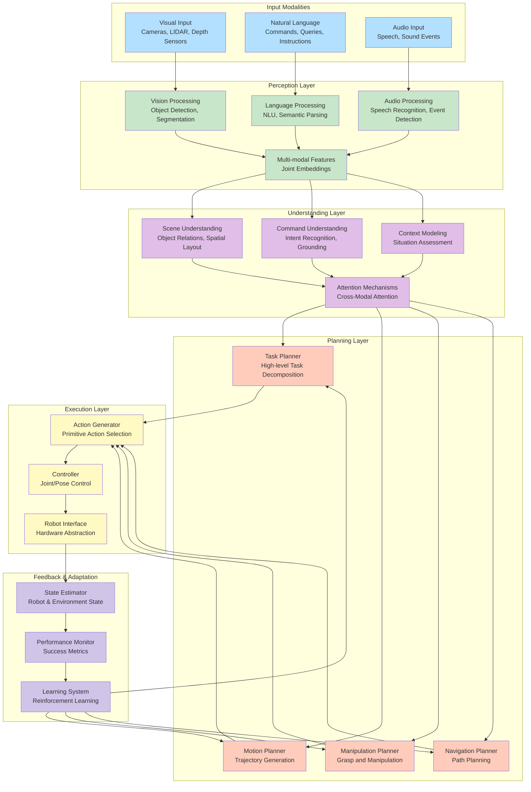

### 1.2 Cross-Modal Attention Architecture
```mermaid
graph LR
    subgraph "Vision Encoder"
        ImgFeatures[Image Features<br/>CNN/Transformer Features]
        VisTokens[Visual Tokens<br/>Patch-based Representations]
        VisEmbed[Visual Embeddings<br/>Projected Features]
    end

    subgraph "Language Encoder"
        TextTokens[Text Tokens<br/>Tokenized Input]
        LangFeatures[Language Features<br/>Transformer Layers]
        LangEmbed[Language Embeddings<br/>Projected Features]
    end

    subgraph "Cross-Modal Fusion"
        CrossAttention[Cross Attention<br/>Vision-Language Interaction]
        JointEmbed[Joint Embedding<br/>Fused Representation]
        OutputHead[Output Head<br/>Action Prediction]
    end

    subgraph "Action Generation"
        ActionSpace[Action Space<br/>Discrete/Continuous Actions]
        ParamGen[Parameter Generator<br/>Action Parameters]
        ControlOutput[Control Output<br/>Robot Commands]
    end

    ImgFeatures --> VisTokens
    VisTokens --> VisEmbed
    TextTokens --> LangFeatures
    LangFeatures --> LangEmbed

    VisEmbed --> CrossAttention
    LangEmbed --> CrossAttention
    CrossAttention --> JointEmbed
    JointEmbed --> OutputHead
    OutputHead --> ActionSpace
    ActionSpace --> ParamGen
    ParamGen --> ControlOutput

    style ImgFeatures fill:#b3e0ff
    style VisTokens fill:#b3e0ff
    style VisEmbed fill:#b3e0ff
    style TextTokens fill:#c8e6c9
    style LangFeatures fill:#c8e6c9
    style LangEmbed fill:#c8e6c9
    style CrossAttention fill:#e1bee7
    style JointEmbed fill:#e1bee7
    style OutputHead fill:#e1bee7
    style ActionSpace fill:#ffccbc
    style ParamGen fill:#ffccbc
    style ControlOutput fill:#ffccbc
```

## 2. Language Understanding and Grounding

### 2.1 Natural Language Command Processing Pipeline
```mermaid
flowchart TD
    Command[Natural Language Command<br/>"Pick up the red cup on the table"]

    subgraph "Preprocessing"
        Tokenizer[Tokenizer<br/>Word/Sentence Segmentation]
        POS[Part-of-Speech Tagging<br/>Grammatical Analysis]
        Dependency[Dependency Parsing<br/>Syntactic Relations]
    end

    subgraph "Semantic Analysis"
        NER[Named Entity Recognition<br/>"red cup", "table"]
        SRL[Semantic Role Labeling<br/>ARG0: robot, ARG1: red cup]
        Coref[Coreference Resolution<br/>Resolve pronouns/anaphora]
    end

    subgraph "Grounding"
        ObjectGround[Object Grounding<br/>Locate "red cup" in visual scene]
        SpatialGround[Spatial Grounding<br/>Understand "on the table"]
        ActionGround[Action Grounding<br/>Map "pick up" to manipulation]
    end

    subgraph "Action Mapping"
        ActionDecompose[Action Decomposition<br/>Approach → Grasp → Lift]
        ParameterExtract[Parameter Extraction<br/>Object pose, grasp type]
        ConstraintApply[Constraint Application<br/>Safety, kinematic limits]
    end

    Command --> Tokenizer
    Tokenizer --> POS
    POS --> Dependency

    Dependency --> NER
    Dependency --> SRL
    Dependency --> Coref

    NER --> ObjectGround
    SRL --> ActionGround
    Coref --> SpatialGround

    ObjectGround --> ActionDecompose
    SpatialGround --> ParameterExtract
    ActionGround --> ConstraintApply

    ActionDecompose --> ParameterExtract
    ParameterExtract --> ConstraintApply

    style Command fill:#b3e0ff
    style Tokenizer fill:#c8e6c9
    style POS fill:#c8e6c9
    style Dependency fill:#c8e6c9
    style NER fill:#e1bee7
    style SRL fill:#e1bee7
    style Coref fill:#e1bee7
    style ObjectGround fill:#ffccbc
    style SpatialGround fill:#ffccbc
    style ActionGround fill:#ffccbc
    style ActionDecompose fill:#fff9c4
    style ParameterExtract fill:#fff9c4
    style ConstraintApply fill:#fff9c4
```

### 2.2 Semantic Role Labeling for VLA Commands
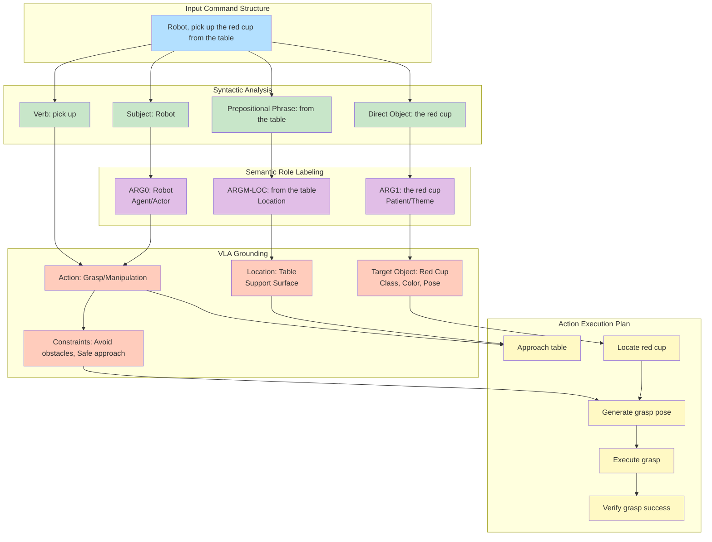

## 3. Vision Processing and Object Detection

### 3.1 Object Detection and Segmentation Pipeline
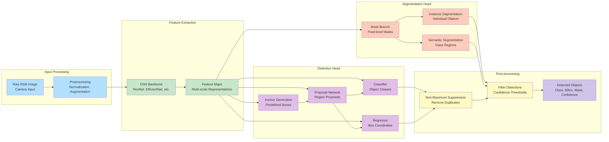

### 3.2 3D Object Pose Estimation
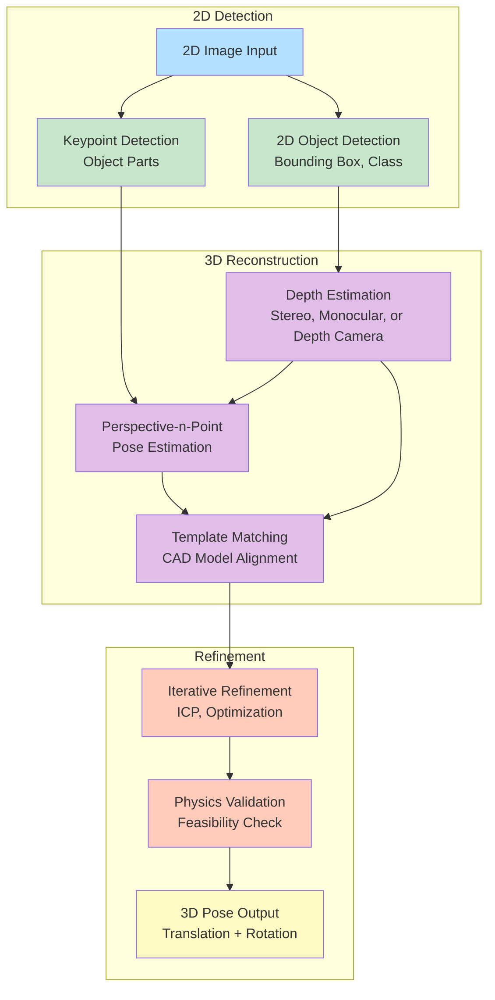

## 4. Action Planning and Execution

### 4.1 Hierarchical Action Planning
```mermaid
graph TD
    subgraph "Task Level"
        HighLevel[High-Level Task<br/>"Bring coffee from kitchen"]
        TaskDecomp[Task Decomposition<br/>Navigate → Find → Grasp → Bring]
    end

    subgraph "Motion Level"
        MotionPlan[Motion Planning<br/>Path to Kitchen]
        GraspPlan[Grasp Planning<br/>Approach → Grasp → Lift]
        Navigation[Navigate to Kitchen<br/>Obstacle Avoidance]
    end

    subgraph "Primitive Level"
        JointControl[Joint Control<br/>Individual Joint Commands]
        Cartesian[Cartesian Control<br/>End-Effector Trajectories]
        Impedance[Impedance Control<br/>Force Compliance]
    end

    subgraph "Execution Monitoring"
        StateMonitor[State Monitoring<br/>Current Robot State]
        FailureDetect[Failure Detection<br/>Unexpected Situations]
        Recovery[Recovery Actions<br/>Plan Adjustment]
    end

    HighLevel --> TaskDecomp
    TaskDecomp --> MotionPlan
    TaskDecomp --> GraspPlan
    TaskDecomp --> Navigation

    MotionPlan --> JointControl
    MotionPlan --> Cartesian
    GraspPlan --> Cartesian
    GraspPlan --> Impedance
    Navigation --> JointControl

    JointControl --> StateMonitor
    Cartesian --> StateMonitor
    Impedance --> StateMonitor

    StateMonitor --> FailureDetect
    FailureDetect --> Recovery
    Recovery --> MotionPlan
    Recovery --> GraspPlan
    Recovery --> JointControl

    style HighLevel fill:#b3e0ff
    style TaskDecomp fill:#b3e0ff
    style MotionPlan fill:#c8e6c9
    style GraspPlan fill:#c8e6c9
    style Navigation fill:#c8e6c9
    style JointControl fill:#e1bee7
    style Cartesian fill:#e1bee7
    style Impedance fill:#e1bee7
    style StateMonitor fill:#ffccbc
    style FailureDetect fill:#ffccbc
    style Recovery fill:#ffccbc
```

### 4.2 Action Generation Process
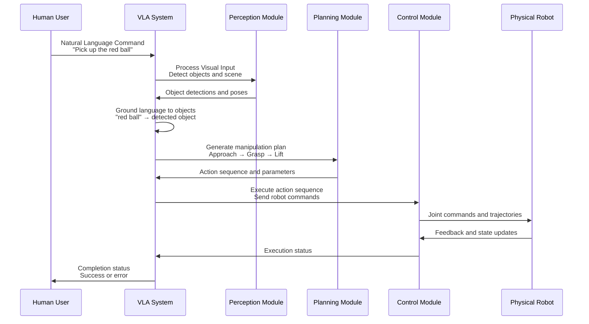

## 5. AI Integration and Learning

### 5.1 Reinforcement Learning for VLA
```mermaid
graph LR
    subgraph "Environment"
        RobotState[Robot State<br/>Joint angles, IMU, vision]
        Environment[Environment State<br/>Objects, obstacles, goal]
    end

    subgraph "RL Agent"
        PolicyNet[Policy Network<br/>Action Selection]
        ValueNet[Value Network<br/>State Evaluation]
        Experience[Experience Buffer<br/>Replay Memory]
    end

    subgraph "Action Execution"
        Action[Action Selection<br/>Gait, manipulation, navigation]
        RobotCtrl[Robot Control<br/>Command Execution]
        Reward[Reward Calculation<br/>Task success, efficiency, safety]
    end

    subgraph "Learning Loop"
        Backprop[Backpropagation<br/>Gradient Update]
        TargetUpdate[Target Network Update<br/>Stability]
        Exploration[Exploration Strategy<br/>Epsilon-greedy, etc.]
    end

    RobotState --> PolicyNet
    Environment --> PolicyNet
    PolicyNet --> Action
    Action --> RobotCtrl
    RobotCtrl --> RobotState
    RobotCtrl --> Environment
    RobotCtrl --> Reward
    Reward --> ValueNet
    Reward --> Experience
    Experience --> Backprop
    ValueNet --> Backprop
    PolicyNet --> Backprop
    Backprop --> TargetUpdate
    TargetUpdate --> PolicyNet
    TargetUpdate --> ValueNet
    Backprop --> Exploration
    Exploration --> PolicyNet

    style RobotState fill:#b3e0ff
    style Environment fill:#b3e0ff
    style PolicyNet fill:#c8e6c9
    style ValueNet fill:#c8e6c9
    style Experience fill:#c8e6c9
    style Action fill:#e1bee7
    style RobotCtrl fill:#e1bee7
    style Reward fill:#e1bee7
    style Backprop fill:#ffccbc
    style TargetUpdate fill:#ffccbc
    style Exploration fill:#ffccbc
```

### 5.2 Imitation Learning Architecture
```mermaid
graph TD
    subgraph "Demonstration Collection"
        ExpertDemo[Expert Demonstrations<br/>Human or teleoperation]
        TrajectoryData[Trajectory Data<br/>States, Actions, Rewards]
        Annotation[Annotations<br/>Object labels, intentions]
    end

    subgraph "Behavior Cloning"
        BehaviorClone[Behavior Cloning<br/>Direct Policy Learning]
        SupervisedLoss[Supervised Loss<br/>MSE between expert and predicted actions]
    end

    subgraph "Adversarial Imitation"
        Discriminator[Discriminator<br/>Expert vs. Agent trajectories]
        Generator[Generator (Agent)<br/>Policy network]
        GANLoss[GAN Loss<br/>Adversarial training]
    end

    subgraph "Policy Improvement"
        PolicyUpdate[Policy Update<br/>Gradient ascent/descent]
        Validation[Validation<br/>Performance evaluation]
        Deployment[Deployment<br/>Real-world execution]
    end

    ExpertDemo --> TrajectoryData
    TrajectoryData --> Annotation
    Annotation --> BehaviorClone
    Annotation --> Discriminator
    TrajectoryData --> Generator

    BehaviorClone --> SupervisedLoss
    SupervisedLoss --> PolicyUpdate

    Discriminator --> GANLoss
    Generator --> GANLoss
    GANLoss --> PolicyUpdate

    PolicyUpdate --> Validation
    Validation --> Deployment

    style ExpertDemo fill:#b3e0ff
    style TrajectoryData fill:#b3e0ff
    style Annotation fill:#b3e0ff
    style BehaviorClone fill:#c8e6c9
    style SupervisedLoss fill:#c8e6c9
    style Discriminator fill:#e1bee7
    style Generator fill:#e1bee7
    style GANLoss fill:#e1bee7
    style PolicyUpdate fill:#ffccbc
    style Validation fill:#ffccbc
    style Deployment fill:#fff9c4
```

## 6. Simulation Integration

### 6.1 Gazebo-ROS-VLA Integration
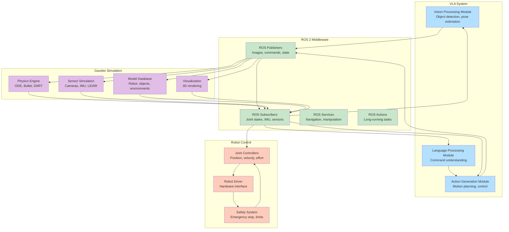

### 6.2 Simulation-to-Reality Transfer
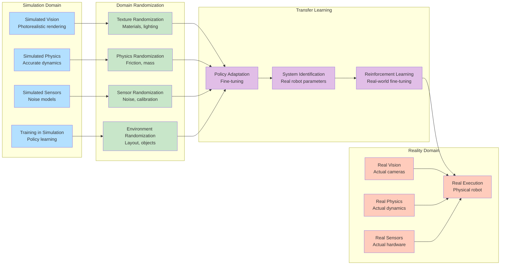

## 7. Safety and Human-Robot Interaction

### 7.1 Safety Architecture for VLA Systems
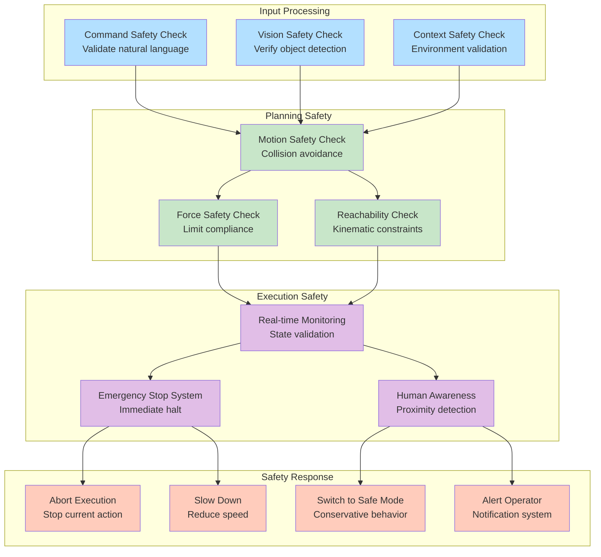

### 7.2 Human-Robot Interaction Patterns
```mermaid
graph LR
    subgraph "Human Input"
        Speech[Spoken Commands<br/>Natural language]
        Gesture[Hand Gestures<br/>Pointing, beckoning]
        Touch[Physical Touch<br/>Guidance, correction]
        Visual[Visual Cues<br/>Eye contact, attention]
    end

    subgraph "Robot Understanding"
        IntentRecognition[Intent Recognition<br/>What human wants]
        AttentionFocus[Attention Focus<br/>Where to look]
        SocialCues[Social Cue Processing<br/>Politeness, etiquette]
    end

    subgraph "Robot Response"
        VerbalResponse[Verbal Response<br/>Speech, confirmation]
        VisualFeedback[Visual Feedback<br/>LEDs, screen, gestures]
        PhysicalAction[Physical Action<br/>Movement, manipulation]
        EmotionalDisplay[Emotional Display<br/>Facial expressions]
    end

    subgraph "Interaction Loop"
        Confirm[Confirmation<br/>Acknowledge understanding]
        Clarify[Clarification<br/>Ask for details]
        Execute[Execution<br/>Perform action]
        Evaluate[Evaluation<br/>Check success]
    end

    Speech --> IntentRecognition
    Gesture --> AttentionFocus
    Touch --> SocialCues
    Visual --> SocialCues

    IntentRecognition --> Confirm
    AttentionFocus --> Clarify
    SocialCues --> Execute

    Confirm --> VerbalResponse
    Clarify --> VisualFeedback
    Execute --> PhysicalAction
    Execute --> EmotionalDisplay

    VerbalResponse --> Evaluate
    VisualFeedback --> Evaluate
    PhysicalAction --> Evaluate
    EmotionalDisplay --> Evaluate

    Evaluate --> IntentRecognition  # Loop back for next interaction

    style Speech fill:#b3e0ff
    style Gesture fill:#b3e0ff
    style Touch fill:#b3e0ff
    style Visual fill:#b3e0ff
    style IntentRecognition fill:#c8e6c9
    style AttentionFocus fill:#c8e6c9
    style SocialCues fill:#c8e6c9
    style Confirm fill:#e1bee7
    style Clarify fill:#e1bee7
    style Execute fill:#e1bee7
    style Evaluate fill:#e1bee7
    style VerbalResponse fill:#ffccbc
    style VisualFeedback fill:#ffccbc
    style PhysicalAction fill:#ffccbc
    style EmotionalDisplay fill:#ffccbc
```

## 8. Performance Optimization

### 8.1 Computational Pipeline Optimization
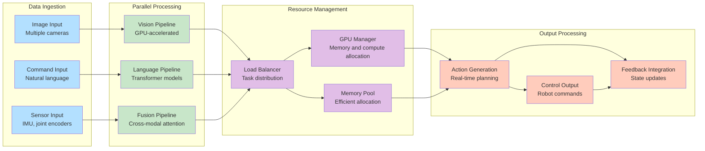

### 8.2 Real-time Performance Architecture
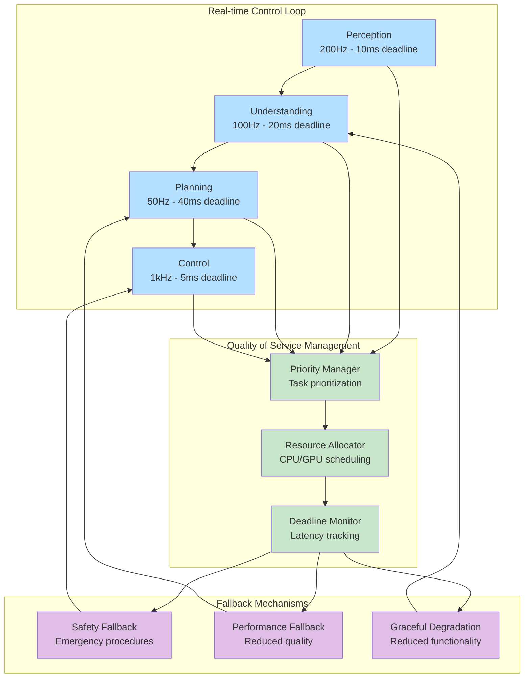

These diagrams provide comprehensive visual representations of Vision-Language-Action system concepts, including system architecture, language processing, vision understanding, action planning, AI integration, simulation, safety considerations, and performance optimization. They help illustrate the complex interactions between different components in VLA systems for Physical AI applications.